# Huawei TechArena 2025: BESS Energy Management System
*by Gen Li (Team SoloGen)*
*Last Update: Oct-27-2025*

> This INTERNAL document notes the overall project methodology, math models, development state.
> - **Repository Status:** Currently developing **Round 2 (Phase 2)** solution.
> - Phase 1 (2024 optimization) artifacts have been archived to `archive_old_files/`.
> - **New Data:** `data/TechArena2025_Phase2_data.xlsx`
> - **Active Branch:** `r2-with-bat-config`

A Python-based Energy Management System (EMS) for optimal Battery Energy Storage System (BESS) operations across multiple European electricity markets considering battery aging and degradation.

## Important Update 
  - [ ] Regarding the degradation model, it is essential that the battery operating period in all submissions is based on a fixed project lifetime of 10 years. While a 70% degradation limit can be considered a practical constraint, it ultimately depends on the specific degradation model each team applies. Consequently, this could lead to significant variations in the results and modeling approaches. 

Therefore, please do not include the end-of-life (EoL) degradation limit in your investment calculations. All investment-related analyses should assume a fixed 10-year operation period. 


## Table of Contents

---

## Context and Objectives
Primary objective: Develop a BESS to optimize financial performance by participating in four key markets: day-ahead (Energy), FCR (power capacity), and aFRR markets (both power and energy), while considering impact of BESS schedule on battery aging and degradation.

The challenge is divided into two phases, three core, interconnected optimization tasks:

### Phase I: One-Year Optimization without Battery Degradation
- **Operation Optimization:** Maximize the BESS's revenue over the year 2024 by developing an optimal charge/discharge strategy to bid in **three** markets: the DA, FCR and aFRR markets.

- **Investment Optimization:** Identify which of five European countries (Germany, Austria, Switzerland, Hungary, Czech Republic) offers the highest Return on Investment (ROI) for installing the BESS over a 10-year period.

- **Configuration Optimization:** Determine the optimal BESS configuration by analyzing the impact of different C-rates and daily cycle limits on profitability and performance.

#### Data for Investment and Configuration Optimization in Phase I
* Participants should still optimize the investment locations and configurations of BESS across the five given regions (DE, AT, CH, HU, CZ) as in Phase I.
  * The weighted-average cost of capital (WACC) remains as: **DE, AT, CH**: 8.3%; **CZ**: 12.0%; **HU**: 15.0%.
  * Inflation rate remains as: **DE**: 2.0%; **AT**: 3.3%; **CH**: 0.1%; **CZ**: 2.9%; **HU**: 4.6%.

* BESS Features remain as:  
  * **Nominal Energy Capacity**: 4472 kWh
  * **Power Rating**: 2236 kW
  * **Investment Cost**: 200 EUR/kWh
  * **(Dis-)Charging Efficiency**: `95% ?`
  * **Charge/Discharge C-Rates**: 0.25C, 0.33C, 0.50C
  * **Daily Number of Cycles**: 1.0, 1.5, 2.0
  * **Cooling Method**: Liquid Cooling


### Phase II: Phase 1 + Integration of Battery Degradation Modeling & aFRR Energy Market 

1. Include **the effect of battery degradation**. In other words, the operational strategy should aim to maximize battery lifetime.
    > - [ ] Comment by Gen: Shall this be optimized as a bi-objective problem, show optimal solutions in Pareto plots?
2. Integrate the **aFRR energy market** into the EMS algorithms for the operational perspective.

```mermaid
flowchart TD
    subgraph Phase_I["<b>PHASE I</b>"]
        direction TB
        P1A["<b>Operation Optimization</b><br/>(Arbitrage, FCR, aFRR)"]
        P1B["<b>Investment Optimization</b>"]
        P1C["<b>Configuration Optimization</b>"]
    end
    
    Arrow["⬇️ <b>PROGRESSION TO PHASE II</b> ⬇️"]
    
    subgraph Phase_II["<b>PHASE II</b>"]
        direction TB
        subgraph Row1[" "]
            direction LR
            P2A["<b>Operation Optimization</b><br/>(Arbitrage, FCR, aFRR,<br/>🔴 <b>Intraday aFRR</b>)"]
            P2B["<b>Investment<br/>Optimization</b><br/><br/><br/>"]
        end
        subgraph Row2[" "]
            direction LR
            P2C["<b>Configuration<br/>Optimization</b><br/><br/><br/>"]
            P2D["🔴 <b>Battery<br/>Degradation</b><br/><br/><br/>"]
        end
    end
    
    Phase_I --> Arrow
    Arrow --> Phase_II
    
    style Phase_I fill:#ffcccc,stroke:#ff6666,stroke-width:4px
    style Phase_II fill:#ccffcc,stroke:#66cc66,stroke-width:4px
    style Row1 fill:#ccffcc,stroke:none
    style Row2 fill:#ccffcc,stroke:none
    style Arrow fill:#ffffff,stroke:#666666,stroke-width:2px,font-size:18px
    style P1A fill:#fff5f5,stroke:#333,stroke-width:3px,font-size:18px,min-width:200px
    style P1B fill:#fff5f5,stroke:#333,stroke-width:3px,font-size:18px,min-width:200px
    style P1C fill:#fff5f5,stroke:#333,stroke-width:3px,font-size:18px,min-width:200px
    style P2A fill:#f5fff5,stroke:#cc0000,stroke-width:4px,font-size:18px,min-width:250px
    style P2B fill:#f5fff5,stroke:#333,stroke-width:3px,font-size:18px,min-width:250px
    style P2C fill:#f5fff5,stroke:#333,stroke-width:3px,font-size:18px,min-width:250px
    style P2D fill:#f5fff5,stroke:#cc0000,stroke-width:4px,font-size:18px,min-width:250px
```




**Key Changes from Phase I to Phase II:**
- 🔴 **NEW**: Intraday aFRR market integration
- 🔴 **NEW**: Battery Degradation modeling and optimization
- ✅ **Continued**: Investment Optimization
- ✅ **Continued**: Configuration Optimization

#### Phase II Market Features Comparison

| Feature | Day-Ahead Market (EPEX SPOT) | FCR Capacity Market | aFRR Capacity Market | **(NEW)** aFRR Energy Market |
|---------|------------------------------|---------------------|----------------------|--------------------|
| **Mechanism** | Blind Auction | Daily Auction | Daily Auction | Continuous Merit Order Activation |
| **Gate Closure Time (D-1)** | 12:00 CET | 8:00 CET | 9:00 CET | 25 min before delivery (rolling) |
| **Product Granularity** | 15 minutes | 4 hours | 4 hours | 15 minutes |
| **Bid Structure** | Energy (MWh) | Symmetric Capacity (MW) | Asymmetric Capacity (MW) | Asymmetric Energy (MWh) |
| **Remuneration** | Pay-as-Cleared (Energy) | Pay-as-Cleared (Capacity) | Pay-as-Bid (Capacity) | Pay-as-Cleared (Energy) |
| **Minimum Bid Size** | 0.1 MW | 1 MW | 1 MW | 1 MW <br> *double-check if correct* |


#### Phase II Evaluation Criteria

| Evaluation Criteria | Ev. Weight | Description |
|---------------------|------------|-------------|
| **Revenue maximization** | 30% | This will evaluate how well the algorithm maximizes revenue based on market prices. |
| **BESS degradation**| 30% | This will evaluate the effect of charge/discharge optimal strategies on battery degradation. |
| **Investment optimization** | 10% | This will evaluate how well the optimal investment locations and markets are identified and assessed. |
| **Configuration optimization** | 10% | This criterion evaluates the analysis of key configuration parameters and their impact on BESS revenue. |
| **Code Quality and Documentation** | 20% | This will evaluate the clarity and structure of the code and deliverable documentation as well as the work presentation. |

> - [ ] Comment by Gen: Crucial to identify the **implementation priorities** of degradation factors: 
> 1. Which adds the largest marginal and which are small, and 
> 2. The complexity these factors add to the optimization model, if it worths including.

Following submission, each team’s battery operational profile will be analyzed using **the ORC Battery Degradation Model** to quantify the impact of their strategy on battery lifetime reduction.
  > - [ ] Comment by Gen: Crucial to study the ORC model and include it in the optimization process.

#### The Interdependence of the Four Optimization Tasks

A deeper analysis reveals a nested, hierarchical relationship between them that must be reflected in the project's modeling strategy.

The **"Optimal Configuration"** task is at the base of the hierarchy. The choice of a C-rate (0.5C, 0.33C, 0.25C) and a daily cycle limit (1.0, 1.5, 2.0) directly defines the physical constraints of the BESS, such as its maximum charge/discharge power and daily energy throughput. In addition, different C-rate and daily cycle limits, as well as SOC upper/lower bounds will also lead to different battery aging profiles. These parameters are fundamental inputs for the **"Optimal Operation"** model.

The **"Optimal Operation"** model forms the core of the analysis. It takes the configuration parameters as given and, based on market price data, calculates the maximum possible annual revenue for that specific BESS configuration in a given country. This revenue figure is the most critical output of the entire project. Furthermore, the operational strategy derived from this model directly influences battery degradation, which is a key consideration in Phase II.

Finally, the **"Optimal Investment"** task sits at the top of the hierarchy. It uses the annual revenue figures generated by the **"Optimal Operation"** model as its primary input to calculate the 10-year ROI. The optimal country for investment is simply the one that yields the highest ROI. This task synthesizes the outputs of the other two tasks to provide a comprehensive investment recommendation.


#### Battery Degradation: Why so important?
Battery degradation is a critical factor in the operation and management of Battery Energy Storage Systems (BESS). Over time, batteries lose their capacity to hold charge and their efficiency decreases due to various factors such as charge/discharge cycles, depth of discharge, temperature, and operational strategies.

The impact of aging model selection on battery revenue is significant. 
1. Using different aging models can substantially influence the optimal operating strategy of the battery. 
2. More complex aging cost models enable higher profits while maintaining similar SOH final impact[^1].


*Figure 1: Comparison of battery aging models showing the trade-off between revenue optimization and battery degradation. More sophisticated aging cost models can achieve higher profitability while maintaining similar final SOH values.*
> - [ ] Comment from Gen: It's crucial to understand this graph.


#### Major Factors Affecting Battery Degradation During Operation
- [ ] TODO: Prioritize Battery Degradation Factors by P1-P3 (P1 the highest)

| **Factor** | **Impact on Battery Degradation** |
|--------|-------------------------------|
| **Temperature** <br> >consider regional temperature variations across the five given regions. | • Both high and low temperatures accelerate different degradation modes.<br>• High temperature (>40 °C): Speeds up side reactions (e.g., SEI growth, electrolyte decomposition, gas formation) → capacity fade and internal resistance rise.<br>• Low temperature (<0 °C): Increases lithium plating on the anode during charging → irreversible lithium loss and safety risks.<br>• Thermal management is critical; degradation roughly doubles for every 10 °C increase (Arrhenius behavior). |
| `P1` **Charge/Discharge Rate (C-rate)** | • Higher C-rates accelerate degradation.<br>• In fast charging, lithium ions can't diffuse fast enough → lithium plating on the anode.<br>• High discharge rates cause increased internal heating, mechanical strain, and contact loss which causes reduced active material utilization and faster capacity fade. |
| `P1` **SoC Range** | • Operating at very high or very low SoC accelerates aging.<br>• High SoC (>90%): Cathode oxidation, transition metal dissolution, electrolyte oxidation.<br>• Low SoC (<10%): Copper dissolution from the anode current collector and deep lithiation damage.<br>• *Restriction of SoC window (e.g., 20–80%) can minimize structural and chemical stress.* |
| `p1` **Depth of Discharge** | • Larger DoD (e.g., 0–100%) shortens cycle life; shallow cycling (e.g., 20–80%) improves lifetime.<br>• Each cycle's voltage and strain swing cause mechanical and chemical stress on electrodes.<br>• High DoD → More electrode expansion/contraction → micro-cracks and SEI rupture → increased irreversible capacity loss. |
| **Battery Management System (BMS) Strategy** | • Directly influences lifetime by controlling operation conditions.<br>• Smart algorithms (SoC windowing, temperature regulation, current limits) can minimize stress; poor algorithms exacerbate it.<br>• Optimized BMS can double the usable life. |
| `P2` **Calendar Aging (Storage Conditions)** <br> - [ ] check this [aging aware MPC](https://gitlab.lrz.de/open-ees-ses/aging-aware-MPC) | • Even when not in use, batteries degrade over time.<br>• SEI thickening, electrolyte oxidation, and loss of cyclable lithium occur during storage, especially at high temperature and SoC.<br>• Degradation is faster at high SoC and high temperature — typically expressed as a function of (T, SoC). |

#### [Same data for Investment and Configuration Optimization as Phase I](#data-for-investment-and-configuration-optimization-in-phase-i)


#### Bonus: Challenge for real-time trading: Uncertain aFRR energy activation and revenue
* In reality, aFRR energy is activated on a 4-second level based on the cross-border marginal price (CBMP) computed in the PICASSO platform. 4-second CBMP prices are not provided by Huawei, but could be downloaded here: https://www.transnetbw.de/en/energy-market/ancillary-services/picasso 
* If you want to do considerations on 4-second prices, use data from TNG (TransnetBW TSO).


## Methodology Overview

- Data pipeline 
- Modelling (assumption, model used, and implementation method)
- Optimization (solver, parameters, and performance)
- Results and analysis, visualization approach
- Important finding, figures, pictures and Conclusion 

## Mathematical Model 

### Phase 1 Operation Optimization: One-Year Optimization without Battery Degradation

#### Objective Function
The objective is to maximize the total net profit over the one-year horizon. This is the sum of day-ahead energy arbitrage revenue and ancillary service capacity payments (FCR + aFRR), minus the cost of energy purchased for charging.

$$ 
\begin{equation}
\max \; Z = \mathbb{P}^{DA} + \mathbb{P}^{ANCI}  
\end{equation}
$$
Where:
$$ 
\begin{equation}
\mathbb{P}^{DA} = \sum_{t\in T} \Bigg( \frac{P_{DA}(t)}{1000}\, p_{\mathrm{dis}}(t) - \frac{P_{DA}(t)}{1000}\, p_{\mathrm{ch}}(t) \Bigg)\, \Delta t    
\end{equation}
$$

$$
\begin{equation}
\mathbb{P}^{ANCI} = \sum_{b\in B} \Big( P_{FCR}(b)\, c_{fcr}(b) + P^{\mathrm{pos}}_{aFRR}(b)\, c^{\mathrm{pos}}_{aFRR}(b) + P^{\mathrm{neg}}_{aFRR}(b)\, c^{\mathrm{neg}}_{aFRR}(b) \Big) 
\end{equation}
$$
* Where $T$ is the set of 15-minute intervals in 2024 (35,040 intervals); $B$ is the set of 4-hour blocks (6 blocks/day × 365 days = 2,190 blocks), and $t \in b$ denotes the set of 16 consecutive 15-minute intervals within block $b$.
* The first term $\mathbb{P}^{DA}$ is day-ahead net profit.  
  * $p_{\mathrm{dis}}(t)$ and $p_{\mathrm{ch}}(t)$ are the nominal discharge and charge power (bids) at time $t$ (kW), respectively. 
  * $P_{DA}(t)$ is the day-ahead market price at time $t$ (EUR/MWh). 
  * $\Delta t$ is the time step duration (hours).
* The second term $\mathbb{P}^{ANCI}$ is ancillary service capacity profit.
  * Bids $c(b)$ are in MW and prices $P(b)$ are in EUR/MW/h (hourly rates). Multiplying by $\Delta b = 4$ hours yields EUR per block.
    > - [x] When the capacity is reserved but not fully, can one still bid in the DA market with the remaining capacity? $\leftarrow$ if FCR is reserved, as its bi-directional, then both DA charge and discharge bids are forbidden. If aFRR is reserved, then only one direction (charge or discharge) is allowed.


#### Constraints
##### **(Cst-0): Variable domains**
$$
\begin{align}
& p_{\mathrm{ch}}(t) \ge 0,\quad p_{\mathrm{dis}}(t) \ge 0 && \forall t\in T \\
& c_{fcr}(b) \ge 0,\quad c^{\mathrm{pos}}_{aFRR}(b) \ge 0,\quad c^{\mathrm{neg}}_{aFRR}(b) \ge 0 && \forall b\in B \\
& y_{\mathrm{ch}}(t), y_{\mathrm{dis}}(t) \in \{0,1\} && \forall t\in T \\
& y_{fcr}(b), y^{\mathrm{pos}}_{aFRR}(b), y^{\mathrm{neg}}_{aFRR}(b) \in \{0,1\} && \forall b\in B
\end{align}
$$

##### **(Cst-1): Energy Balance (SOC Dynamics)**
Update SOC based on charge/discharge actions considering efficiencies:
$$
\begin{equation}
e_{\mathrm{soc}}(t) = e_{\mathrm{soc}}(t-1) + \Big( p_{\mathrm{ch}}(t)\,\eta_{\mathrm{ch}} - \frac{p_{\mathrm{dis}}(t)}{\eta_{\mathrm{dis}}} \Big)\, \Delta t
    \qquad \forall t\in T    
\end{equation}
$$


For t=1, use the initial SOC:
$$
\begin{equation}
e_{\mathrm{soc}}(1) = e_{\mathrm{soc}}^{\mathrm{init}} + \Big( p_{\mathrm{ch}}(1)\,\eta_{\mathrm{ch}} - \frac{p_{\mathrm{dis}}(1)}{\eta_{\mathrm{dis}}} \Big)\, \Delta t 
\end{equation}
$$

Where $e_{\mathrm{soc}}$ is the state of charge, and $\eta_{\mathrm{ch}}$ and $\eta_{\mathrm{dis}}$ are the charging and discharging efficiencies, respectively.

##### **(Cst-2): SOC Limits**
BESS energy stays within min/max SOC bounds:
$$
\begin{align}
SOC_{\min}\,E_{\mathrm{nom}} \le e_{\mathrm{soc}}(t) \le SOC_{\max}\,E_{\mathrm{nom}} \qquad \forall t\in T
\end{align}
$$

Where $E_{\mathrm{nom}}$ is the nominal energy capacity of the BESS.


##### **(Cst-3): Simultaneous Operation Prevention**
No charge and discharge at the same time:
$$
\begin{equation}
    y_{\mathrm{ch}}(t) + y_{\mathrm{dis}}(t) \le 1 \qquad \forall t\in T
\end{equation}
$$

##### **(Cst-4): Market Co-optimization Power Limits**
Set total power limits on both energy bids and reserved ancillary service capacities. The total committed power in either direction (charge or discharge) must not exceed the BESS power rating.

*   **Total Discharge Power Limit:** The sum of any discharge bid in the DA market plus any reserved capacity for services that require discharging (FCR is symmetric, positive aFRR is discharge) must not exceed the maximum power rating.
$$
  \begin{align}
    p_{\mathrm{dis}}(t) + 1000\,c_{fcr}(b) + 1000\,c^{\mathrm{pos}}_{aFRR}(b) &\le P^{\mathrm{config}}_{\max} \qquad \forall b\in B,\, \forall t\in b
  \end{align}
$$
*   **Total Charge Power Limit:** The sum of any charge bid in the DA market plus any reserved capacity for services that require charging (FCR is symmetric, negative aFRR is charge) must not exceed the maximum power rating.
$$
  \begin{align}
    p_{\mathrm{ch}}(t) + 1000\,c_{fcr}(b) + 1000\,c^{\mathrm{neg}}_{aFRR}(b) &\le P^{\mathrm{config}}_{\max} \qquad \forall b\in B,\, \forall t\in b
  \end{align}
$$
Where we convert capacity bids (in MW) to kW by $\times 1000$.

##### **(Cst-5): Daily Cycle Limits**
Limit the total daily discharged energy throughput from the battery. This is based on the energy drawn from the DC side, accounting for discharge inefficiency.
$$
\begin{align}
    \sum_{t\in d} \frac{p_{\mathrm{dis}}(t)}{\eta_{\mathrm{dis}}}\,\Delta t \;\le\; N_{\mathrm{cycles}}\,E_{\mathrm{nom}}
    \qquad \forall d\in D
  \end{align}
$$


##### **(Cst-6): Ancillary Service Energy Reserve**
Maintain sufficient energy reserve for ancillary service activation, accounting for BESS efficiency. The parameter $\tau$ represents the assumed worst-case continuous activation duration for reserves (typically set to $\Delta t = 0.25$ hours for this model).

*   To provide upward regulation (discharge), the available energy in the BESS must cover the energy drawn from the DC side.
$$
\begin{equation}
    \frac{\big(1000\,c_{fcr}(b) + 1000\,c^{\mathrm{pos}}_{aFRR}(b)\big)\,\tau}{\eta_{\mathrm{dis}}} \leq e_{\mathrm{soc}}(t) - SOC_{\min}\,E_{\mathrm{nom}}  
    \qquad \forall b\in B,\, \forall t\in b
\end{equation}
$$
*   To provide downward regulation (charge), the available headroom in the BESS must be able to store the energy delivered to the DC side.
$$
\begin{equation}
    \big(1000\,c_{fcr}(b) + 1000\,c^{\mathrm{neg}}_{aFRR}(b)\big)\,\tau\,\eta_{\mathrm{ch}} \leq SOC_{\max}\,E_{\mathrm{nom}} - e_{\mathrm{soc}}(t)
    \qquad \forall b\in B,\, \forall t\in b
\end{equation}
$$

##### **(Cst-7): Ancillary Service Market Mutual Exclusivity**
Prevent simultaneous bidding in multiple markets for the same block:
$$
\begin{equation}
    y_{fcr}(b) + y^{\mathrm{pos}}_{aFRR}(b) + y^{\mathrm{neg}}_{aFRR}(b) \le 1 \qquad \forall b\in B
\end{equation}
$$

##### **(Cst-8): Cross-Market Mutual Exclusivity**
To ensure physical feasibility, the BESS cannot commit to charging in one market while simultaneously committing to discharging in another for the same time interval. The following constraints prevent such conflicting bids between the Day-Ahead market (15-min interval `t`) and ancillary service capacity markets (4-hour block `b`).

*   A Day-Ahead discharge bid (`y_dis(t)=1`) is incompatible with reserving capacity for charging services (FCR or negative aFRR).
*   A Day-Ahead charge bid (`y_ch(t)=1`) is incompatible with reserving capacity for discharging services (FCR or positive aFRR).

$$
\begin{align}
    y_{\mathrm{dis}}(t) + y_{fcr}(b) + y^{\mathrm{neg}}_{aFRR}(b) &\le 1 \qquad \forall b\in B,\, \forall t\in b \\
    y_{\mathrm{ch}}(t) + y_{fcr}(b) + y^{\mathrm{pos}}_{aFRR}(b) &\le 1 \qquad \forall b\in B,\, \forall t\in b
\end{align}
$$


#####  **(Cst-9): Minimum and Maximum Bid Sizes**
Bids can be non-zero only if the corresponding binary is 1; if non-zero, they must also satisfy minimum size and available power. $P^{\mathrm{config}}_{\max}$ is the configured maximum power rating of the BESS (kW).
* Day-Ahead Energy Bids:
    $$
    \begin{align}
        y_{\mathrm{ch}}(t)\,\text{MinBid}_{da} \cdot 1000 &\le p_{\mathrm{ch}}(t) \le y_{\mathrm{ch}}(t)\,P^{\mathrm{config}}_{\max} && \forall t\in T \\
        y_{\mathrm{dis}}(t)\,\text{MinBid}_{da} \cdot 1000 &\le p_{\mathrm{dis}}(t) \le y_{\mathrm{dis}}(t)\,P^{\mathrm{config}}_{\max} && \forall t\in T
    \end{align}
    $$
    > Notice $p(t)$ is in kW, while $\text{MinBid}_{da}$ is in MW.
* FCR Capacity Bids:
$$
  \begin{equation}
    y_{fcr}(b)\,\text{MinBid}_{fcr} \le c_{fcr}(b) \le y_{fcr}(b)\,\frac{P^{\mathrm{config}}_{\max}}{1000} \qquad \forall b\in B \\
  \end{equation}
$$
* aFRR Capacity Bids:
$$
\begin{align}
    y^{\mathrm{pos}}_{aFRR}(b)\,\text{MinBid}_{afrr} \le c^{\mathrm{pos}}_{aFRR}(b) \le y^{\mathrm{pos}}_{aFRR}(b)\,\frac{P^{\mathrm{config}}_{\max}}{1000} && \forall b\in B \\
    y^{\mathrm{neg}}_{aFRR}(b)\,\text{MinBid}_{afrr} \le c^{\mathrm{neg}}_{aFRR}(b) \le y^{\mathrm{neg}}_{aFRR}(b)\,\frac{P^{\mathrm{config}}_{\max}}{1000} && \forall b\in B
\end{align}
$$


### Phase 1 Investment Optimization: 10-Year ROI Calculation without Battery Degradation


### Phase 2: Phase 1 + Battery Degradation Modeling

We extend the Phase I MILP (Base Model) by incorporating the aFRR Energy Market (model (i)) and replacing the rigid daily cycle limit with a flexible degradation cost function (model (ii)). In addition, calendar aging costs are introduced in model (iii). The following subsections detail these modifications.

#### Model (i): Base Model + aFRR Energy Market
The aFRR Energy market (15-min granularity) operates similarly to the DA market as a price-taker energy market. We introduce new variables for bidding in this market and update all constraints that manage power and energy.

- **New Variables:** $p^{\mathrm{pos}}_{aFRR,E}(t)$ (discharge/positive) and $p^{\mathrm{neg}}_{aFRR,E}(t)$ (charge/negative) for energy bids in the aFRR energy market.
- **New Binaries:** $y^{\mathrm{pos}}_{aFRR,E}(t)$ and $y^{\mathrm{neg}}_{aFRR,E}(t)$ to manage minimum bids.
- **Objective Function:** A new profit term $\mathbb{P}^{aFRR\_E}$ is added:
$$
\mathbb{P}^{aFRR\_E} = \sum_{t\in T} \left( \frac{P^{\mathrm{pos}}_{aFRR, E}(t)}{1000}\, p^{\mathrm{pos}}_{aFRR, E}(t) + \frac{P^{\mathrm{neg}}_{aFRR, E}(t)}{1000}\, p^{\mathrm{neg}}_{aFRR, E}(t) \right)\, \Delta t
$$

This requires revising the core physical constraints to prevent conflicts. We define new **total** charge/discharge variables:

$$
\begin{align}
p^{\mathrm{total}}_{\mathrm{ch}}(t) &= p_{\mathrm{ch}}(t) + p^{\mathrm{neg}}_{aFRR,E}(t) \quad \forall t \\
p^{\mathrm{total}}_{\mathrm{dis}}(t) &= p_{\mathrm{dis}}(t) + p^{\mathrm{pos}}_{aFRR,E}(t) \quad \forall t
\end{align}
$$

These totals are then used to update the SOC, power, and mutual exclusivity constraints from Phase I.

#### Integrating Battery Degradation as a Linear Cost
We replace the rigid Phase I constraint (Cst-5) $\sum p_{\mathrm{dis}} \le N_{\mathrm{cycles}} E_{\mathrm{nom}}$ with a flexible and more profitable **degradation cost function**, $C^{\mathrm{Degradation}}$. This cost is subtracted from the objective function, allowing the optimizer to find the best balance between high-revenue, high-degradation actions and low-revenue, low-degradation actions.

Following the literature provided (Collath et al., 2023; Xu et al., 2017), we model this cost as the sum of calendar and cyclic aging:
$$ C^{\mathrm{Degradation}} = C^{\mathrm{cal}} + C^{\mathrm{cyc}} $$


#### Model (ii): Model (i) + Cyclic Aging Cost
Based on the methodology from Xu et al. (2017), we model cyclic aging as a **convex piecewise-linear cost of discharge**. The battery's energy capacity $E_{\mathrm{nom}}$ is divided into $J$ segments (e.g., 10 segments of 10% SOC). Discharging from a shallower segment (e.g., 90-100% SOC) is "cheaper" than discharging from a deeper segment (e.g., 20-30% SOC).

- **New Variables:** $e_{\mathrm{soc},j}(t)$ (energy in segment $j$), $p^{\mathrm{ch}}_{j}(t)$ (charge to segment $j$), and $p^{\mathrm{dis}}_{j}(t)$ (discharge from segment $j$).
- **Cost Function:** $C^{\mathrm{cyc}} = \sum_{t \in T} \sum_{j \in J} \left( c^{\mathrm{cost}}_{j} \cdot \frac{p^{\mathrm{dis}}_{j}(t)}{\eta_{\mathrm{dis}}} \cdot \Delta t \right)$
- **Logic:** The marginal cost $c^{\mathrm{cost}}_{j}$ increases as $j$ increases (deeper discharge), e.g., $c_1 < c_2 < ... < c_J$. The optimizer will naturally prefer to discharge from the "cheapest" (shallowest) available segment first, perfectly modeling the non-linear cost of deep discharges in a linear framework.

##### Calculation of the the Marginal Cost for Each SOC Segment $c^{\mathrm{cost}}_{j}$
The marginal cost for discharging from each SOC segment is derived from the BESS's total investment cost and its expected lifetime. To ensure the model is physically-grounded and traceable, the parameters have been re-evaluated based on LFP-specific data and the competition's economic specifications. The cost is distributed non-linearly based on a standard power-law model for LFP battery degradation.

**Step 1: Re-evaluating the Cycle Life Parameter ($a$)**
The relationship between cycle life and Depth of Discharge (DoD) is described by the power-law model $\text{CycleLife}(D) = a \cdot D^{-b}$, where $b=2$ is a behaviorally superior choice for an EMS as it strongly penalizes deep discharges. The parameter $a$ (cycle life at 100% DoD) is derived from the LFP-specific commercial claim of 6,000 cycles at 80% DoD:
$$
a = \text{CycleLife}(0.8) \times (0.8)^{-b} = 6000 \times (0.8)^{-2} = 3840 \text{ cycles}
$$
This provides a traceable, LFP-specific value for the cycle life at 100% DoD.

**Step 2: Recalculating the Cost per Full Cycle**
The total BESS investment is $4472 \text{ kWh} \times 200 \text{ EUR/kWh} = 894,400 \text{ EUR}$. Amortizing this over the re-evaluated lifetime gives the new cost per full (100% DoD) cycle:
$$
\text{Cost per Full Cycle} = \frac{894,400 \text{ EUR}}{3840 \text{ cycles}} \approx 232.92 \text{ EUR/Cycle}
$$

**Step 3: Calculate Final Marginal Costs**
The marginal aging weights $w_j$ for each of the 10 segments are derived from the power-law model ($w_j \propto D_j^2 - D_{j-1}^2$) and are self-normalizing. The marginal cost for discharging 1 kWh from segment $j$ is then:
$$
c^{\mathrm{cost}}_{j} = \frac{\text{Cost per Full Cycle} \times w_j}{E_{\mathrm{nom}} \times \text{Segment Size}}
$$
For example, for the first and shallowest segment ($j=1$), the marginal cost is:
$$
c^{\mathrm{cost}}_{1} = \frac{232.92 \text{ EUR/Cycle} \times 0.01}{4472 \text{ kWh} \times 0.1} \approx 0.0052 \text{ EUR/kWh}
$$

| **Segment ($j$)** | **SOC Range** | **Multiplier ($w_j$)** | **Marginal Cost ($c^{\mathrm{cost}}_{j}$) [EUR/kWh]** |
|---|---|---|---|
| 1 | 90-100% | 0.01 | 0.0052 |
| 2 | 80-90% | 0.03 | 0.0156 |
| 3 | 70-80% | 0.05 | 0.0260 |
| 4 | 60-70% | 0.07 | 0.0364 |
| 5 | 50-60% | 0.09 | 0.0469 |
| 6 | 40-50% | 0.11 | 0.0573 |
| 7 | 30-40% | 0.13 | 0.0677 |
| 8 | 20-30% | 0.15 | 0.0781 |
| 9 | 10-20% | 0.17 | 0.0885 |
| 10 | 0-10% | 0.19 | 0.0990 |

*This approach ensures that the sum of costs incurred by discharging all 10 segments equals exactly one "Cost per Full Cycle" (€232.92), making the model economically consistent and physically traceable.*

#### Model (iii): Model (ii) + Calendar Aging Cost
Based on Collath et al. (2023), calendar aging is a non-linear function of the average State of Charge (SOC). We linearize this cost using Special Ordered Sets of Type 2 (SOS2), a standard MILP technique.

- **New Variables:** $\lambda_{t,i}$ (weighting variables for linearization).
- **Cost Function:** $C^{\mathrm{cal}} = \sum_{t \in T} c^{\mathrm{cal}}_{\mathrm{cost}}(t)$
- **Logic:** The total SOC $e_{\mathrm{soc}}(t)$ and its corresponding cost $c^{\mathrm{cal}}_{\mathrm{cost}}(t)$ are expressed as a convex combination of $I$ pre-calculated (SOC, Cost) breakpoints from the literature's non-linear curve.
$$ e_{\mathrm{soc}}(t) = \sum_{i \in I} \lambda_{t,i} \cdot SOC^{\mathrm{point}}_i \quad | \quad c^{\mathrm{cal}}_{\mathrm{cost}}(t) = \sum_{i \in I} \lambda_{t,i} \cdot Cost^{\mathrm{point}}_i $$
$$ \sum_{i \in I} \lambda_{t,i} = 1 \quad | \quad \{\lambda_{t,i}\} \text{ are SOS2 variables} $$

This formulation directly penalizes holding the battery at high SOC, as prioritized in the project description.

##### Calculation of the Calendar Aging Breakpoints
The breakpoints for the SOS2 linearization are derived from the "scaled" model presented in Collath et al. (2023), specifically from Figure 3. This approach uses a fixed linearization point (representing a mid-life aging state) for the entire BESS lifetime to better optimize for Net Present Value (NPV). The costs are monetized using the project's BESS investment cost.

**Step 1: Extract Physical Degradation Data**
We extract data from the linearized calendar degradation model in Collath et al. (2023, Fig. 3), using the "scaled" curve for a past calendar capacity loss of $Q_{\mathrm{loss,cal}} = 5\%$. This provides the physical relationship between SOC and the rate of capacity loss. We select five key breakpoints:

- SOC 0%: $\approx 0.00005\%$ capacity loss per 15 min
- SOC 25\%: $\approx 0.00006\%$ capacity loss per 15 min
- SOC 50\%: $\approx 0.00010\%$ capacity loss per 15 min
- SOC 75\%: $\approx 0.00018\%$ capacity loss per 15 min
- SOC 100\%: $\approx 0.00030\%$ capacity loss per 15 min

**Step 2: Monetize the Degradation Cost**
The physical capacity loss is converted into an hourly economic cost. The total BESS investment is $4472 \text{ kWh} \times 200 \text{ EUR/kWh} = 894,400 \text{ EUR}$. The hourly cost at each breakpoint is calculated by converting the 15-minute loss rate to an hourly rate.
$$
\text{Hourly Cost} = \text{Total Investment} \times (\text{15-min Loss Rate} \times 4)
$$
For example, for the 100% SOC breakpoint:
$$
\text{Cost}_{100\%} = 894,400 \text{ EUR} \times (0.00030\% \times 4) \approx 10.73 \text{ EUR/hr}
$$

**Step 3: Define Final Breakpoint Parameters**
The calculated (SOC, Cost) pairs form the breakpoints for the SOS2 constraints. These values provide the concrete parameters for the model, ensuring it accurately penalizes holding the battery at high states of charge.

| **Breakpoint ($i$)** | **SOC Level** | **SOC ($SOC_i^{\mathrm{point}}$) [kWh]** | **Cost ($Cost_i^{\mathrm{point}}$) [EUR/hr]** |
|---|---|---|---|
| 1 | 0% | 0 | 1.79 |
| 2 | 25% | 1118 | 2.15 |
| 3 | 50% | 2236 | 3.58 |
| 4 | 75% | 3354 | 6.44 |
| 5 | 100% | 4472 | 10.73 |

*These values provide the concrete parameters for the SOS2 constraints, ensuring the model accurately penalizes holding the battery at high states of charge.*

### Phase II - Model (iii) Mathematical Formulation

#### Objective Function
The objective is to maximize the total profit, defined as market revenues minus degradation costs.
$$
\max \; Z = \mathbb{P}^{DA} + \mathbb{P}^{ANCI} + \mathbb{P}^{aFRR\_E} - \alpha \cdot (C^{\mathrm{cyc}} + C^{\mathrm{cal}})
$$


#### Constraints

##### Degradation-Aware SOC Dynamics (Replaces Cst-1)
$$
\begin{align}
e_{\mathrm{soc},j}(t) &= e_{\mathrm{soc},j}(t-1) + \left( p^{\mathrm{ch}}_{j}(t) \eta_{\mathrm{ch}} - \frac{p^{\mathrm{dis}}_{j}(t)}{\eta_{\mathrm{dis}}} \right) \Delta t & \forall t, \forall j \\
e_{\mathrm{soc}}(t) &= \sum_{j \in J} e_{\mathrm{soc},j}(t) & \forall t \\
p^{\mathrm{total}}_{\mathrm{ch}}(t) &= \sum_{j \in J} p^{\mathrm{ch}}_{j}(t) & \forall t \\
p^{\mathrm{total}}_{\mathrm{dis}}(t) &= \sum_{j \in J} p^{\mathrm{dis}}_{j}(t) & \forall t \\
p^{\mathrm{total}}_{\mathrm{ch}}(t) &= p_{\mathrm{ch}}(t) + p^{\mathrm{neg}}_{aFRR,E}(t) & \forall t \\
p^{\mathrm{total}}_{\mathrm{dis}}(t) &= p_{\mathrm{dis}}(t) + p^{\mathrm{pos}}_{aFRR,E}(t) & \forall t
\end{align}
$$

##### SOC & Segment Limits (Replaces Cst-2)
$$
\begin{align}
SOC_{\min}\,E_{\mathrm{nom}} &\le e_{\mathrm{soc}}(t) \le SOC_{\max}\,E_{\mathrm{nom}} & \forall t \\
0 &\le e_{\mathrm{soc},j}(t) \le E^{\mathrm{seg}}_{j} & \forall t, \forall j
\end{align}
$$

##### Simultaneous Operation Prevention (Replaces Cst-3)
$$
\begin{align}
p^{\mathrm{total}}_{\mathrm{ch}}(t) &\le y^{\mathrm{total}}_{\mathrm{ch}}(t) \cdot P^{\mathrm{config}}_{\max} & \forall t \\
p^{\mathrm{total}}_{\mathrm{dis}}(t) &\le y^{\mathrm{total}}_{\mathrm{dis}}(t) \cdot P^{\mathrm{config}}_{\max} & \forall t \\
y^{\mathrm{total}}_{\mathrm{ch}}(t) + y^{\mathrm{total}}_{\mathrm{dis}}(t) &\le 1 & \forall t
\end{align}
$$

##### Market Co-optimization Power Limits (Replaces Cst-4)
$$
\begin{align}
p^{\mathrm{total}}_{\mathrm{dis}}(t) + 1000\,c_{fcr}(b) + 1000\,c^{\mathrm{pos}}_{aFRR}(b) &\le P^{\mathrm{config}}_{\max} & \forall b, t \in b \\
p^{\mathrm{total}}_{\mathrm{ch}}(t) + 1000\,c_{fcr}(b) + 1000\,c^{\mathrm{neg}}_{aFRR}(b) &\le P^{\mathrm{config}}_{\max} & \forall b, t \in b
\end{align}
$$

##### Ancillary Service Energy Reserve (Keeps Cst-6 Logic)
$$
\begin{align}
    \frac{\big(1000\,c_{fcr}(b) + 1000\,c^{\mathrm{pos}}_{aFRR}(b)\big)\,\tau}{\eta_{\mathrm{dis}}} &\leq e_{\mathrm{soc}}(t) - SOC_{\min}\,E_{\mathrm{nom}} & \forall b, t \in b \\
    \big(1000\,c_{fcr}(b) + 1000\,c^{\mathrm{neg}}_{aFRR}(b)\big)\,\tau\,\eta_{\mathrm{ch}} &\leq SOC_{\max}\,E_{\mathrm{nom}} - e_{\mathrm{soc}}(t) & \forall b, t \in b
\end{align}
$$
*(Where $\tau$ is the reserve duration, e.g., 0.25h)*

##### Ancillary Capacity Market Exclusivity (Keeps Cst-7)
$$
 \begin{equation}
C^{\mathrm{cal}} = \sum_{t \in T} c^{\mathrm{cal}}_{\mathrm{cost}}(t) \cdot \Delta t
    y_{fcr}(b) + y^{\mathrm{pos}}_{aFRR}(b) + y^{\mathrm{neg}}_{aFRR}(b) \le 1 \qquad \forall b
 \end{equation}
 $$
 
##### Cross-Market Mutual Exclusivity (Replaces Cst-8)
$$
\begin{align}
    y^{\mathrm{total}}_{\mathrm{ch}}(t) + y_{fcr}(b) + y^{\mathrm{pos}}_{aFRR}(b) &\le 1 & \forall b, t \in b \\
    y^{\mathrm{total}}_{\mathrm{dis}}(t) + y_{fcr}(b) + y^{\mathrm{neg}}_{aFRR}(b) &\le 1 & \forall b, t \in b
\end{align}
$$
 
##### Minimum Bids & Binary Logic (Updates Cst-9)
$$
\begin{align}
    y_{\mathrm{ch}}(t)\,\text{MinBid}_{da} \cdot 1000 &\le p_{\mathrm{ch}}(t) \le y_{\mathrm{ch}}(t)\,P^{\mathrm{config}}_{\max} & \forall t \\
    y_{\mathrm{dis}}(t)\,\text{MinBid}_{da} \cdot 1000 &\le p_{\mathrm{dis}}(t) \le y_{\mathrm{dis}}(t)\,P^{\mathrm{config}}_{\max} & \forall t \\
    y^{\mathrm{pos}}_{aFRR,E}(t)\,\text{MinBid}_{afrr\_e} \cdot 1000 &\le p^{\mathrm{pos}}_{aFRR,E}(t) \le y^{\mathrm{pos}}_{aFRR,E}(t)\,P^{\mathrm{config}}_{\max} & \forall t \\
    y^{\mathrm{neg}}_{aFRR,E}(t)\,\text{MinBid}_{afrr\_e} \cdot 1000 &\le p^{\mathrm{neg}}_{aFRR,E}(t) \le y^{\mathrm{neg}}_{aFRR,E}(t)\,P^{\mathrm{config}}_{\max} & \forall t \\
    y^{\mathrm{total}}_{\mathrm{ch}}(t) &\ge y_{\mathrm{ch}}(t); \quad y^{\mathrm{total}}_{\mathrm{ch}}(t) \ge y^{\mathrm{neg}}_{aFRR,E}(t) & \forall t \\
    y^{\mathrm{total}}_{\mathrm{dis}}(t) &\ge y_{\mathrm{dis}}(t); \quad y^{\mathrm{total}}_{\mathrm{dis}}(t) \ge y^{\mathrm{pos}}_{aFRR,E}(t) & \forall t
\end{align}
$$
*(Similar min/max bid constraints for $c_{fcr}$, $c^{\mathrm{pos}}_{aFRR}$, $c^{\mathrm{neg}}_{aFRR}$ remain from Phase I)*

##### Calendar Aging PWL Constraints (New)
$$
\begin{align}
    e_{\mathrm{soc}}(t) &= \sum_{i \in I} \lambda_{t,i} \cdot SOC^{\mathrm{point}}_i & \forall t \\
    c^{\mathrm{cal}}_{\mathrm{cost}}(t) &= \sum_{i \in I} \lambda_{t,i} \cdot Cost^{\mathrm{point}}_i & \forall t \\
    \sum_{i \in I} \lambda_{t,i} &= 1 & \forall t \\
    \{\lambda_{t,i}\}_{i \in I} &\text{ are SOS2 variables} & \forall t
\end{align}
$$


## Investment Optimization

## Implementation Pipeline

### Model Statistics 
- **Variables**: ~`xxx`total (70,000 continuous + 35,000 binary)
- **Constraints**: ~`xxx` total (35K SOC dynamics + 105K market/power constraints)
- **Solve Time**: `xxx` minutes per scenario with `SolverName` (`??s` time limit)
- **Memory Usage**: ~`xxx` GB per optimization instance

## Model Validation 

### Validation Approach and Testing Scenarios

**Scenarios:**
  i) Scenario 1 (S1): Baseline without battery degradation
  ii) Scenario 2 (S2): Including battery degradation effects

1. T1: model behaviors in four markets in S1 (4 in total):
2. T2: model behaviors in four markets in S2 with different battery degradation profiles ($4N$ in total, where $N$ is the number of degradation profiles tested)


## Final Results and Analysis


## Appendix

### Appendix 1:Nomenclature

| **Symbol** | **Definition** | **Unit** | **Type** |
|------------|---------------|----------|----------|
| **Sets & Indices** | | | |
| $T$ | Set of 15-minute time intervals, $t \in T = \{1, ..., 35040\}$ | - | Set |
| $B$ | Set of 4-hour ancillary service blocks, $b \in B = \{1, ..., 2190\}$ | - | Set |
| $t \in b$ | Denotes the set of 16 intervals $t$ within a block $b$ | - | Relation |
| $D$ | Set of 24-hour days, $d \in D = \{1, ..., 365\}$ | - | Set |
| **Parameters** | | | |
| $P_{DA}(t)$ | Day-ahead electricity price in interval $t$ | EUR/MWh | Input |
| $P_{FCR}(b)$ | FCR capacity price in block $b$ | EUR/MW/h | Input |
| $P^{\mathrm{pos}}_{aFRR}(b)$ | Positive aFRR capacity price in block $b$ | EUR/MW/h | Input |
| $P^{\mathrm{neg}}_{aFRR}(b)$ | Negative aFRR capacity price in block $b$ | EUR/MW/h | Input |
| $E_{\mathrm{nom}}$ | Nominal energy capacity of the BESS | kWh | Input |
| $P^{\mathrm{config}}_{\max}$ | Maximum charge/discharge power for the selected configuration | kW | Input |
| $\eta_{\mathrm{ch}}, \eta_{\mathrm{dis}}$ | Charging and discharging efficiencies | - | Input |
| $SOC_{\min}, SOC_{\max}$ | Min/max state of charge as a fraction of $E_{\mathrm{nom}}$ | - | Input |
| $N_{\mathrm{cycles}}$ | Daily cycle limit for the selected configuration | cycles/day | Input |
| $e^{\mathrm{init}}_{\mathrm{soc}}$ | Initial state of charge at the start of the simulation period | kWh | Input |
| $\Delta t$ | Duration of a time interval (0.25 h) | h | Constant |
| $\text{MinBid}_{da}$ | Minimum bid size for day-ahead market | MW | Input |
| $\text{MinBid}_{fcr}$ | Minimum bid size for FCR market | MW | Input |
| $\text{MinBid}_{afrr}$ | Minimum bid size for aFRR market | MW | Input |
| **Decision Variables** | | | |
| $p_{\mathrm{ch}}(t)$ | Power used to charge the BESS in interval $t$ | kW | Continuous $\geq 0$ |
| $p_{\mathrm{dis}}(t)$ | Power discharged from the BESS in interval $t$ | kW | Continuous $\geq 0$ |
| $e_{\mathrm{soc}}(t)$ | Energy stored in the BESS at the end of interval $t$ | kWh | Continuous $\geq 0$ |
| $c_{fcr}(b)$ | Symmetric FCR capacity bid for block $b$ | MW | Continuous $\geq 0$ |
| $c^{\mathrm{pos}}_{aFRR}(b)$ | Positive aFRR capacity bid for block $b$ | MW | Continuous $\geq 0$ |
| $c^{\mathrm{neg}}_{aFRR}(b)$ | Negative aFRR capacity bid for block $b$ | MW | Continuous $\geq 0$ |
| $y_{\mathrm{ch}}(t)$ | Binary variable, 1 if charging in interval $t$ | - | Binary |
| $y_{\mathrm{dis}}(t)$ | Binary variable, 1 if discharging in interval $t$ | - | Binary |
| $y_{fcr}(b)$ | Binary variable, 1 if bidding for FCR in block $b$ | - | Binary |
| $y^{\mathrm{pos}}_{aFRR}(b)$ | Binary variable, 1 if bidding for positive aFRR in block $b$ | - | Binary |
| $y^{\mathrm{neg}}_{aFRR}(b)$ | Binary variable, 1 if bidding for negative aFRR in block $b$ | - | Binary |


### Appendix 2: Reviewer's Feedback from Phase I
* All submitted codes must be **well-commented** and the comments should be written in clear English.
* Only **open-source** Python libraries are allowed, no commercial or restricted packages.
* Each submission must include **a detailed report** describing the solution methodology, optimization approach, and results analysis.
* This is not a coding competition, but **an Energy Management System algorithm development challenge**, participants should **demonstrate a clear understanding of EMS concepts**.
    > - [ ] Comment by Gen: For this purpose, I believe a web-based dashboard visualization of the results will be highly practical.
* Ensure that **all specified countries are properly included** and analyzed in your results.

### Appendix 3: Project Q&A Google Doc
* [Link to Phase II Q&A Document](https://docs.google.com/document/d/1NHbycnyq_boqihHSY8Gw4GtrUCdVqaBkwO1my5SLUsY/edit?mc_cid=906bdbf5ee&mc_eid=b9c7877496&pli=1&tab=t.0)

#### Asked Questions
1. I have a few questions regarding battery degradation and the activation of aFRR prices:
Is the final submission format still the same — with three output files? Now in phase 2, the 10 years period ROI is considering each years' battery Degradation(capacity become lower in the next year)?
    > **A**: Yes

2. Should we include more BESS Configuration details (e.g. working temperature, charging power profile,charging time etc.) in the Configuration output file? Or can we just describe these assumptions in the documentation and use them to optimize our operation strategy?
    > **A**: Good point. Please include any additional aspects or parameters you believe would help improve the accuracy of the battery degradation calculation.

3. The final evaluation will use our Operation files with the BESS model build by the organizer , But we cannot know the specific model detail during our work. We need to find information on our own to identified different component that effects the battery degradation and improve our Operation strategy, is my understanding correct?
    > **A**: Yes, calculating battery degradation is the main challenge. There are multiple models with different levels of complexity; your task is to select the appropriate model and all required sub-components to achieve the most accurate degradation estimate.

4. In the data, a project lifetime of 15 years was given. Now, in Phase II, the BESS might not reach this lifetime under aggressive cycling, which we will consider in the degradation model. The question is: which state of health (SoH) should we assume as the End of Life? Is 70% SoH acceptable?
    > **A**: Please optimize the dispatch strategy over the entire project lifetime. Keep in mind that the battery degradation rate must be calculated, and the corresponding results should be included. Huawei’s reference degradation model will then be used to evaluate the actual degradation of your battery over time.
Additional Hint:
 In your report, include a discussion on how your operational strategy affects battery degradation. Reflect on how your dispatch choices balance profitability versus battery lifetime, showing awareness of the trade-off between aging and long-term performance.

5. (For bonus) Do we need to retrieve the data from the PICASSO platform manually (for example via Scratch or manual download), or is there an automated way to access it?
    > **A**: You do not necessarily need to retrieve any data from the PICASSO platform, as you might use the time series provided for aFRR energy prices. However, a good way to compute the amount of energy actually activated on PICASSO is to use the cross-border marginal price. In this case, a scratcher would be a good way to retrieve the data.
6. (For bonus) Once we have downloaded the data from PICASSO, how can we compute the marginal price using that data? Are there any specific files or variables we should refer to?
    > **A**: The cross-border marginal price is already the signal published by PICASSO. This can be downloaded, for example, on the TransnetBW webpage: https://www.transnetbw.de/en/energy-market/ancillary-services/picasso

<!--
### BESS EMS Knowledge Hub
 (Battery) energy storage systems (BESS) are categorized by both their application (use-case) and their technology type. The main categories by application are:
- **By Application**
  - **Residential (Home Storage Systems):** 
  Used for single-family homes, primarily for backup, self-consumption, or time-of-use bill optimization[^1][^2].
  - **Commercial & Industrial (C&I):** 
  Installed at business or factory sites to reduce electricity bills, ensure energy security, or provide backup power[^3][^4].
  - **Utility-Scale (Grid-Scale):** 
  Connected to the grid to provide large-scale services such as grid balancing, energy arbitrage, frequency regulation, and participation in electricity markets[^2][^1][^5].
  - **Front-of-the-Meter (FTM):** 
  Directly connected to the grid and participate in wholesale energy markets and ancillary service markets[^6][^3].
  - **Behind-the-Meter (BTM):** 
  Installed on the customer side of the meter to serve onsite demands and reduce costs rather than provide direct grid services[^3][^7].

- **By Technology / Chemistry**
  - **Lithium-Ion Batteries:** 
  The dominant technology, widely used across all scales for their high energy density and efficiency[^1][^8][^9].
  - **Lead-Acid Batteries:** 
  Older and less energy-dense, but still used for low-cost or backup storage[^1][^8].
  - **Flow Batteries:** 
  Use liquid electrolytes, suitable for long-duration and grid-scale storage due to scalability and long life[^1][^8].
  - **Sodium-Based (e.g., Sodium-Sulfur, Sodium-Ion):** 
  Used for stationary and grid applications, especially where high temperatures are acceptable[^10][^8][^4].
  - **Other Chemistries:** 
  Nickel-cadmium, solid-state, zinc-air, and other emerging types for niche or future applications[^1][^10][^8].

- **Alternative Storage Forms**
  - **Thermal Storage:** 
  Stores energy as heat or cold for later use, often for industrial or building applications[^4].
  - **Mechanical Storage:** 
  Includes pumped hydro, compressed air, and flywheels — mainly for grid-scale or specialized uses[^2][^11][^4].

- **Connection Type**
  - **On-grid:** 
  Directly connected and interact with the regional or national power grid[^2].
  - **Off-grid:** 
  Provide power in remote or standalone applications[^2].

- **Ownership Models**
  - **Customer-owned:** 
  Owned by an individual, business, or building operator[^2].
  - **Utility-owned:** 
  Deployed and managed by a utility for grid services[^2].
  - **Third-party owned:** 
  Operated by a service provider under lease or service agreements[^2]. -->


<!-- ### Pyomo Framework Overview -->


## Sample Data 
The whole data set spans across the whole year of 2024 with 15-minute resolution for DA market and aFRR energy markets, and 4-hour resolution for FCR and aFRR capacity markets. Below we provide sample data snippets for each market.

### DA
Remark: For DA data, DE_LU column represents the joint Germany and Luxembourg market prices.

```json
[
  {
    "timestamp":"2024-01-01T00:00:00.000",
    "DE_LU":39.91,
    "AT":14.08,
    "CH":25.97,
    "HU":0.1,
    "CZ":0.1
  },
  {
    "timestamp":"2024-01-01T00:15:00.000",
    "DE_LU":-0.04,
    "AT":14.08,
    "CH":25.97,
    "HU":0.1,
    "CZ":0.1
  },
  {
    "timestamp":"2024-01-01T00:30:00.001",
    "DE_LU":-9.01,
    "AT":0.48,
    "CH":25.97,
    "HU":0.1,
    "CZ":0.1
  },
  {
    "timestamp":"2024-01-01T00:45:00.001",
    "DE_LU":-29.91,
    "AT":-3.64,
    "CH":25.97,
    "HU":0.1,
    "CZ":0.1
  }
]
```


### aFRR Energy
```json
[
  {
    "timestamp":"2024-01-01T00:00:00.000",
    "DE_Pos":50.3411486486,
    "DE_Neg":29.702029703,
    "AT_Pos":86.43,
    "AT_Neg":0.0,
    "CH_Pos":38.7,
    "CH_Neg":0.0,
    "HU_Pos":0.0,
    "HU_Neg":0.0,
    "CZ_Pos":144.0,
    "CZ_Neg":0.0
  },
  {
    "timestamp":"2024-01-01T00:15:00.000",
    "DE_Pos":46.9457142857,
    "DE_Neg":40.87125,
    "AT_Pos":85.25,
    "AT_Neg":0.17,
    "CH_Pos":38.8,
    "CH_Neg":8.32,
    "HU_Pos":0.0,
    "HU_Neg":0.6014018923,
    "CZ_Pos":117.26,
    "CZ_Neg":53.39
  },
  {
    "timestamp":"2024-01-01T00:30:00.001",
    "DE_Pos":43.8748717949,
    "DE_Neg":21.2391111111,
    "AT_Pos":85.44,
    "AT_Neg":0.73,
    "CH_Pos":38.76,
    "CH_Neg":0.0,
    "HU_Pos":0.0,
    "HU_Neg":1.1334522217,
    "CZ_Pos":140.84,
    "CZ_Neg":62.84
  }
]
```

### FCR
```json
[
  {
    "timestamp":"2024-01-01T00:00:00.000",
    "DE":114.8,
    "AT":114.8,
    "CH":114.8,
    "HU":3.1851080706,
    "CZ":416.0
  },
  {
    "timestamp":"2024-01-01T04:00:00.000",
    "DE":104.4,
    "AT":104.4,
    "CH":104.4,
    "HU":3.1851080706,
    "CZ":416.0
  },
  {
    "timestamp":"2024-01-01T08:00:00.001",
    "DE":68.8,
    "AT":68.8,
    "CH":68.8,
    "HU":3.1851080706,
    "CZ":416.0
  },
  {
    "timestamp":"2024-01-01T12:00:00.001",
    "DE":77.6,
    "AT":77.6,
    "CH":77.6,
    "HU":3.1851080706,
    "CZ":390.4
  }
]
```


### aFRR Capacity
```json
[
  {
    "timestamp":"2024-01-01T08:00:00.001",
    "DE_Pos":6.33,
    "DE_Neg":13.07,
    "AT_Pos":5.57,
    "AT_Neg":8.5,
    "CH_Pos":6.66,
    "CH_Neg":23.08,
    "HU_Pos":10.048546094,
    "HU_Neg":13.327884282,
    "CZ_Pos":29.1639497143,
    "CZ_Neg":10.6757588259
  },
  {
    "timestamp":"2024-01-01T12:00:00.001",
    "DE_Pos":4.12,
    "DE_Neg":15.02,
    "AT_Pos":3.56,
    "AT_Neg":9.52,
    "CH_Pos":4.41,
    "CH_Neg":20.63,
    "HU_Pos":0.0,
    "HU_Neg":0.0,
    "CZ_Pos":23.342256,
    "CZ_Neg":4.1489131297
  },
]
```

### Technical Description: "Scaled and Discounted" Aging Cost (Collath et al. - Section 3.4)

This describes an advanced optimization technique designed to maximize the Net Present Value (NPV) of a BESS, rather than just the total cumulative profit. It consists of two independent but complementary parts: "Scaling" and "Discounting".

**1. "Scaled" Aging Model (The Baseline)**

* **Problem:** The "Non-scaled" (or "fully accurate") degradation model  exhibits a sublinear dependency on time (e.g., $\sqrt{t}$). This results in prohibitively high aging costs in the early years of operation when the battery is new.
* **Behavioral Consequence:** This high initial cost forces the optimizer to be overly conservative, forgoing valuable early-life profit opportunities. This leads to a sub-optimal lifetime NPV.
* **"Scaled" Solution:** This approach linearizes the degradation model at a *fixed* point, representing a mid-life aging state ($Q^{loss,cal}=5\%$ and $Q^{loss,cyc}=5\%$), and uses this *same* linearization for the *entire* BESS lifetime.
* **Result:** The optimizer perceives a moderate, consistent aging cost from Year 1. This encourages more consistent profit generation across the lifetime and results in a significantly higher NPV (340.3 EUR/kWh) compared to the "Non-scaled" model (291.9 EUR/kWh).

**2. "Discounted" Aging Model (The NPV-aware Enhancement)**

* **Goal:** To further optimize for NPV, this technique "front-loads" profits by internalizing the time value of money (as defined by the interest rate $i$) directly into the optimizer's cost function.
* **Mechanism:** The aging cost parameter $c^{aging}$ (in EUR/kWh) is no longer treated as a constant. It is made time-dependent by applying the discount rate in reverse, as defined in **Equation (28)**:

    $$c^{aging^{\prime}} = c^{aging} \cdot (1+i)^{m}$$

* **Variable Definitions:**
    * $c^{aging^{\prime}}$: The new, time-varying aging cost used by the optimizer.
    * $c^{aging}$: The original, "optimal" constant aging cost (the tuning parameter).
    * $i$: The interest rate used for the project's financial evaluation.
    * $m$: The current fractional year of operation since the start of the simulation.

* **Impact on Optimization:**
    * In the early years ($m \approx 0$), the optimizer sees a *low* aging cost ($c^{aging^{\prime}} \approx c^{aging}$). This incentivizes more aggressive cycling to capture immediate profit.
    * In the later years ($m$ is large), the optimizer sees an *exponentially higher* aging cost ($c^{aging^{\prime}} \gg c^{aging}$), which strongly disincentivizes cycling as the perceived cost outweighs the potential profit.

* **Final Outcome:** This strategy intentionally shifts profit generation from the less valuable later years to the highly valuable early years. This results in the highest possible NPV (346.6 EUR/kWh) of all strategies, even if the total cumulative *undiscounted* profit (551.1 EUR/kWh) is slightly lower than the standard "Scaled" model (574.2 EUR/kWh).


___


## Bibliography
[^1]: Collath, Nils, et al. "Increasing the lifetime profitability of battery energy storage systems through aging aware operation." *Applied Energy* 348 (2023): 121531.
<!-- [^1]: https://www.acebattery.com/blogs/different-types-of-battery-energy-storage-systems-bess  
[^2]: https://en.wikipedia.org/wiki/Grid_energy_storage  
[^3]: https://www.deutz.com.au/resources/what-are-the-different-types-of-battery-energy-storage-systems-bess/  
[^4]: https://www.dcntglobal.com/battery-energy-storage-a-clear-guide-to-investing-in-energy-storage-systems/  
[^5]: https://www.futuremarketinsights.com/reports/grid-scale-stationary-battery-storage-market  
[^6]: https://www.irena.org/News/articles/2025/Aug/Battery-energy-storage-systems-key-to-renewable-power-supply-demand-gaps  
[^7]: https://www.bves.de/en/energy-storage/commercial-industry/  
[^8]: https://www.solaxpower.com/blogs/what-is-commercial-and-industrial-energy-storage-system.html  
[^9]: https://www.beny.com/types-of-battery-energy-storage-systems/  
[^10]: https://www.deutz.com.au/resources/what-are-the-different-types-of-battery-energy-storage-systems-bess/  
[^11]: https://en.wikipedia.org/wiki/Grid_energy_storage   -->
