# GridKey Module Integration Guide

> **Target Audience**: Development Team (Module A, B, D, E)
> **Purpose**: Define how to assemble the independently developed modules into the final GridKey system.

## 1. System Architecture Recap

The system operates as a data pipeline orchestrated by the AI Agent (Module E).

```mermaid
sequenceDiagram
    participant User
    participant E as Module E (Agent)
    participant A as Module A (Weather)
    participant B as Module B (Prices)
    participant D as Module D (Optimizer)

    User->>E: "Optimize battery for Munich tomorrow"
    E->>A: get_weather("Munich")
    A-->>E: {solar_forecast: [...], wind_forecast: [...]}
    
    E->>B: get_prices("DE_LU")
    B-->>E: {da_prices: [...], fcr_prices: [...]}
    
    Note over E,D: INTEGRATION POINT
    E->>D: POST /api/v1/optimize
    Note right of E: Payload: {market_prices: B_output, generation_forecast: A_output}
    
    D-->>E: {schedule: [...], profit: 125.5}
    E->>User: "Optimization complete. Expected profit €125.5..."
```



## 2. Interface Definitions (The Handshake)

### 2.1 Module D Inputs (What You Expect)
Your `OptimizerService` expects two specific dictionaries. You need to verify if your teammates' modules produce compatible structures.

**Input 1: Market Prices (from Module B)**
```json
{
  "da": {"timestamps": [...], "values": [...]},
  "fcr": {"timestamps": [...], "values": [...]},
  "afrr_energy": {"timestamps": [...], "pos": [...], "neg": [...]},
  "afrr_capacity": {"timestamps": [...], "pos": [...], "neg": [...]}
}
```

**Input 2: Generation Forecast (from Module A)**
```json
{
  "solar": {"timestamps": [...], "values": [...]},
  "wind": {"timestamps": [...], "values": [...]}
}
```

> **Action Item**: Send your `src/service/adapter.py` logic to Teammate A & B. Ask them: *"Does your JSON output match these keys?"* If not, **one of you must change**. It is usually easier for valid adapter logic to be updated in Module D than to change core logic in A/B.

### 2.2 Module D Output (What You Provide)
Teammate E (Agent) needs to parse your result.
*   **Provide**: The `OptimizationResult` schema.
*   **How**: Run your service (`startup.bat`), go to `http://localhost:8000/docs`, and download the **OpenAPI JSON**. Send this file to Teammate E.

## 3. Deployment Strategy (Putting it Together)

Since Module D is Dockerized, we should containerize A and B as well and run them together.

### 3.1 Docker Compose (Recommended)
Create a `docker-compose.yml` in the project root to spin up all services.

```yaml
version: '3.8'
services:
  # Your Teammate's Services
  weather-service:
    build: ./helpers/weather_service  # Assuming location
    ports: ["8001:8001"]
    
  price-service:
    build: ./helpers/price_service
    ports: ["8002:8002"]

  # Your Service
  optimizer-service:
    build: .
    ports: ["8000:8000"]
    environment:
      - MODULE_A_URL=http://weather-service:8001
      - MODULE_B_URL=http://price-service:8002

  # Orchestrator (Optional, if E is a service)
  agent-service:
    build: ./agent
    environment:
      - OPTIMIZER_URL=http://optimizer-service:8000
```

## 4. Verification Steps

1.  **Mock Integration**: write a script `test_full_flow.py` that:
    *   Imports Module A and B (if they are Python libs) or simple Mocks.
    *   Calls `OptimizerService`.
    *   Prints the result.
    This proves D handles A/B's data correctly.

2.  **API Integration**:
    *   Run `startup.sh`.
    *   Have Teammate E send a request to your `localhost:8000`.

## 5. Checklist for You (Module D Owner)

- [ ] **Export API Spec**: Save `http://localhost:8000/openapi.json` and share with Teammate E.
- [ ] **Verify Adapters**: Review Module A/B output samples. Update `src/service/adapter.py` if keys don't match.
- [ ] **Prepare Docker**: Ensure your Docker image builds cleanly so Teammate E can run it easily.
