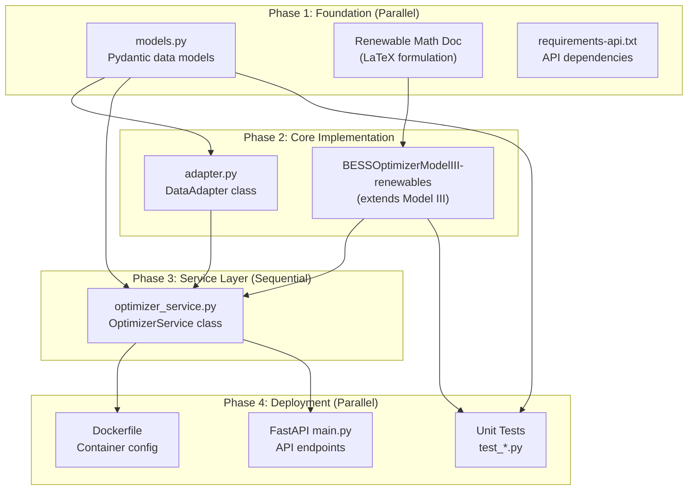

# IBM Hackathon Development Plan: Module D - Optimizer Service

**Document Version:** 1.0
**Date:** 2026-01-31
**Status:** Draft / Awaiting Approval

---

## 1. Executive Summary

This document outlines the implementation plan for upgrading the existing **GridKey BESS Optimizer** into **Module D: Optimizer Service**, as defined in the [GridKey WatsonX Blueprint](file:///d:/my_projects/GridPro/wtsx_hack_gridkey/GridKey_WatsonX_Blueprint.md) (Sections 6.4 - 6.6).

### Key Deliverables

| Deliverable                     | Description                                                                      | Priority |
| ------------------------------- | -------------------------------------------------------------------------------- | -------- |
| **Renewable Integration** | Extend MILP model with PV/Wind generation constraints                            | P0       |
| **Service Wrapper**       | Design `OptimizerService` class with standardised I/O                          | P0       |
| **Data Adapters**         | Implement `DataAdapter`, `OptimizationInput`, `OptimizationResult` classes | P0       |
| **Docker Deployment**     | Create `Dockerfile` and update `requirements.txt` for containerisation       | P1       |
| **API Documentation**     | Define input/output JSON schemas with samples                                    | P0       |

---

## 2. Current State Analysis

### 2.1 Existing Codebase Structure

```
GridKey/
├── src/
│   └── core/
│       └── optimizer.py          # Core MILP optimizer (2417 lines)
│           ├── BESSOptimizerModelI    # Base + aFRR Energy Market
│           ├── BESSOptimizerModelII   # + Cyclic Aging Cost
│           └── BESSOptimizerModelIII  # + Calendar Aging Cost (target)
├── config/
│   └── Config.yml                # Unified configuration
├── data/                         # Market data (Parquet/Excel)
└── requirements.txt              # Current dependencies
```

### 2.2 Key Existing Methods in BESSOptimizerModelIII

| Method                         | Lines       | Purpose                             |
| ------------------------------ | ----------- | ----------------------------------- |
| `__init__()`                 | 2002-2099   | Initialize with degradation configs |
| `load_and_preprocess_data()` | 268-386     | Load Excel market data              |
| `build_optimization_model()` | 2143-2318   | Build Pyomo MILP model              |
| `solve_model()`              | (inherited) | Solve with detected solver          |
| `extract_solution()`         | 2320-2390   | Extract results to dict             |

### 2.3 Missing Components (Gap Analysis)

> **TODO:** The mathematical formulation for renewable integration must be explicitly documented in a dedicated LaTeX file (e.g., `doc/p2_model/p2_renewable_extension.tex`) to align with the existing Model I-III documentation.

| Component              | Blueprint Requirement                                                 | Current Status     |
| ---------------------- | --------------------------------------------------------------------- | ------------------ |
| Renewable Variables    | `P_renewable_self`, `P_renewable_export`, `P_renewable_curtail` | ❌ Not implemented |
| Renewable Constraints  | Generation balance, export revenue                                    | ❌ Not implemented |
| `OptimizerService`   | Unified service wrapper                                               | ❌ Not implemented |
| `DataAdapter`        | Format conversion layer                                               | ❌ Not implemented |
| `OptimizationInput`  | Standardised input model                                              | ❌ Not implemented |
| `OptimizationResult` | Standardised output model                                             | ❌ Not implemented |
| `ScheduleEntry`      | Per-timestep schedule item                                            | ❌ Not implemented |
| Dockerfile             | Container deployment                                                  | ❌ Not implemented |

---

## 3. Proposed Changes (By Implementation Phase)

> This section is organized according to the [Implementation Flow & Dependencies](#8-implementation-flow--dependencies) diagram.

### Phase 1: Foundation (Parallel Tasks)

These components have **no dependencies** and can be implemented simultaneously. Details refer to [ibm_hack_dev_phase1.md](ibm_hack_dev_phase1.md).


### Phase 2: Core Implementation (Parallel After Phase 1)

These components depend on **Phase 1** but can be implemented **in parallel with each other**. Details refer to [ibm_hack_dev_phase2.md](ibm_hack_dev_phase2.md).

---

### Phase 3: Service Layer (Sequential)

This component is the **critical path** — it depends on both Phase 1 and Phase 2. Details refer to [ibm_hack_dev_phase3.md](ibm_hack_dev_phase3.md).

---


### Phase 4: Deployment (Parallel After Phase 3)

These components depend on **Phase 3** but can be implemented **in parallel with each other**. Details refer to [ibm_hack_dev_phase4.md](ibm_hack_dev_phase4.md).

---

#### 4.1 [NEW] Dockerfile — Container Configuration

Location: `GridKey/Dockerfile`

**Depends on:** `optimizer_service.py` (3.1)

```dockerfile
# GridKey Optimizer Service - Production Docker Image
FROM python:3.11-slim

# Metadata
LABEL maintainer="GridKey Team"
LABEL version="1.0"
LABEL description="BESS Optimizer Service with Renewable Integration"

# Set working directory
WORKDIR /app

# Install system dependencies for solvers
RUN apt-get update && apt-get install -y --no-install-recommends \
    build-essential \
    && rm -rf /var/lib/apt/lists/*

# Copy requirements first (for layer caching)
COPY requirements.txt requirements-api.txt ./

# Install Python dependencies
RUN pip install --no-cache-dir -r requirements.txt \
    && pip install --no-cache-dir -r requirements-api.txt

# Copy application code
COPY src/ ./src/
COPY config/ ./config/
COPY data/ ./data/

# Set Python path
ENV PYTHONPATH=/app

# Expose API port
EXPOSE 8000

# Health check
HEALTHCHECK --interval=30s --timeout=10s --start-period=5s --retries=3 \
    CMD curl -f http://localhost:8000/health || exit 1

# Run FastAPI server
CMD ["uvicorn", "src.api.main:app", "--host", "0.0.0.0", "--port", "8000"]
```

---

#### 4.2 [NEW] FastAPI main.py — API Endpoints

Location: `src/api/main.py`

**Depends on:** `optimizer_service.py` (3.1)

> **Note:** API endpoint implementation is detailed in [Section 4: API Input/Output Format Specification](#4-api-inputoutput-format-specification).

---

#### 4.3 [NEW] Unit Tests

Location: `src/test/`

**Depends on:** `models.py` (1.1), `BESSOptimizerModelIII-renewables` (2.1)

> **Note:** Test files and commands are detailed in [Section 5: Verification Plan](#5-verification-plan).

---

## 4. API Input/Output Format Specification

### 4.1 Optimize Endpoint

**Endpoint:** `POST /api/v1/optimize`

#### Request Body (JSON)

```json
{
  "location": "Munich",
  "country": "DE_LU",
  "model_type": "III",
  "c_rate": 0.5,
  "alpha": 1.0,
  "time_horizon_hours": 48,
  
  "market_prices": {
    "da_prices": [39.91, -0.04, -9.01, "..."],
    "fcr_prices": [114.8, 104.4, 68.8, "..."],
    "afrr_capacity_pos": [6.33, 4.12, "..."],
    "afrr_capacity_neg": [13.07, 15.02, "..."],
    "afrr_energy_pos": [50.34, 46.94, "..."],
    "afrr_energy_neg": [29.70, 40.87, "..."]
  },
  
  "renewable_generation": [0, 0, 0, 10.5, 25.3, 45.2, "..."]
}
```

#### Response Body (JSON)

```json
{
  "status": "success",
  "data": {
    "objective_value": 1847.52,
    "net_profit": 1523.18,
  
    "revenue_breakdown": {
      "day_ahead": 892.45,
      "fcr": 324.80,
      "afrr_capacity": 456.12,
      "afrr_energy": 98.33,
      "renewable_export": 75.82
    },
  
    "degradation_cost": 324.34,
    "cyclic_aging_cost": 287.12,
    "calendar_aging_cost": 37.22,
  
    "renewable_utilization": {
      "total_generation_kwh": 185.5,
      "self_consumption_kwh": 92.3,
      "export_kwh": 85.7,
      "curtailment_kwh": 7.5,
      "utilization_rate": 0.96
    },
  
    "schedule": [
      {
        "timestamp": "2024-01-01T00:00:00",
        "action": "charge",
        "power_kw": 1500.0,
        "market": "da",
        "renewable_action": null,
        "renewable_power_kw": 0,
        "soc_after": 0.58
      }
    ],
  
    "soc_trajectory": [0.50, 0.58, 0.67, "..."],
  
    "solve_time_seconds": 12.45,
    "solver_name": "highs",
    "model_type": "III",
    "num_variables": 15234,
    "num_constraints": 28456
  }
}
```

### 4.2 Health Check Endpoint

**Endpoint:** `GET /health`

```json
{
  "status": "healthy",
  "version": "1.0.0",
  "solver_available": "highs",
  "timestamp": "2024-01-01T12:00:00Z"
}
```

---

## 5. Verification Plan

### 5.1 Unit Tests

> **Important:** The project currently lacks comprehensive unit tests for the service layer. New tests need to be created.

#### New Test Files to Create

| Test File                              | Covers                        | Priority |
| -------------------------------------- | ----------------------------- | -------- |
| `src/test/test_models.py`            | Pydantic model validation     | P0       |
| `src/test/test_adapter.py`           | DataAdapter conversion logic  | P0       |
| `src/test/test_optimizer_service.py` | OptimizerService workflow     | P0       |
| `src/test/test_renewable_model.py`   | Renewable constraints in MILP | P1       |

#### Test Commands

```bash
# Run all tests
pytest src/test/ -v

# Run specific test file
pytest src/test/test_models.py -v

# Run with coverage
pytest src/test/ --cov=src/service --cov-report=html
```

### 5.2 Integration Tests

#### Test Optimization Flow

```bash
# Run existing validation script (modified for new service)
python src/validation/run_optimization.py --model III --country DE_LU --hours 24
```

#### Test Docker Container

```bash
# Build image
docker build -t gridkey-optimizer:latest .

# Run container
docker run -d -p 8000:8000 --name gridkey-opt gridkey-optimizer:latest

# Test health endpoint
curl http://localhost:8000/health

# Test optimize endpoint
curl -X POST http://localhost:8000/api/v1/optimize \
  -H "Content-Type: application/json" \
  -d '{"country": "DE_LU", "model_type": "III", "time_horizon_hours": 24}'

# Cleanup
docker stop gridkey-opt && docker rm gridkey-opt
```

### 5.3 Manual Verification

> **Note:** The following manual tests should be performed after implementation.

1. **Renewable Balance Verification**

   - Load a scenario with known renewable generation
   - Verify: `P_self + P_export + P_curtail = P_renewable` for all timesteps
   - Check: Export revenue appears in `revenue_breakdown`
2. **API Response Validation**

   - Send request via Postman/curl
   - Verify JSON schema matches specification in Section 4
   - Check all required fields are present and correctly typed
3. **Docker Deployment Test**

   - Build and run container on a clean machine
   - Verify solver (HiGHS) is functional inside container
   - Test with 48-hour optimization (should complete within 60 seconds)

---

## 6. Risk Assessment

| Risk                                                   | Impact | Mitigation                                                  |
| ------------------------------------------------------ | ------ | ----------------------------------------------------------- |
| Renewable integration breaks existing MILP feasibility | High   | Implement as separate subclass, extensive testing           |
| Solver not available in Docker                         | Medium | Bundle HiGHS, add fallback solver detection                 |
| API performance under load                             | Low    | Add request timeout, async processing for long runs         |
| Backward compatibility with existing scripts           | Medium | Maintain legacy method signatures, add deprecation warnings |

---

## 7. Open Questions for User

1. **Model Naming:** Should the renewable-enabled model be called `Model IV` or `BESSOptimizerWithRenewables`?
2. **API Framework:** The blueprint specifies FastAPI. Is this confirmed, or should we consider alternatives (e.g., Flask)?
3. **Renewable Constraints:** The blueprint specifies "no curtailment penalty". Should we add an optional penalty parameter for future flexibility?
4. **Docker Base Image:** Should we use `python:3.11-slim` or a solver-optimized image?
5. **Test Data:** Are there existing renewable generation datasets to use for testing, or should we generate synthetic data?

---

## 8. Implementation Flow & Dependencies

The following diagram shows which modules can be implemented in **parallel** vs. **sequentially**:



### Dependency Summary

| Module | Depends On | Can Parallel With |
|--------|------------|-------------------|
| `models.py` | None | `requirements-api.txt`, LaTeX doc |
| LaTeX formulation | None | `models.py`, `requirements-api.txt` |
| `requirements-api.txt` | None | `models.py`, LaTeX doc |
| `BESSOptimizerModelIII-renewables` | LaTeX formulation | `adapter.py` |
| `adapter.py` | `models.py` | `BESSOptimizerModelIII-renewables` |
| `optimizer_service.py` | `models.py`, `adapter.py`, Optimizer | ❌ Sequential |
| `Dockerfile` | `optimizer_service.py` | `main.py`, Tests |
| `main.py` (API) | `optimizer_service.py` | `Dockerfile`, Tests |
| Unit Tests | `models.py`, Optimizer | `Dockerfile`, `main.py` |

---

## Document History

| Version | Date       | Author       | Changes       |
| ------- | ---------- | ------------ | ------------- |
| 1.0     | 2026-01-31 | GridKey Team | Initial draft |
