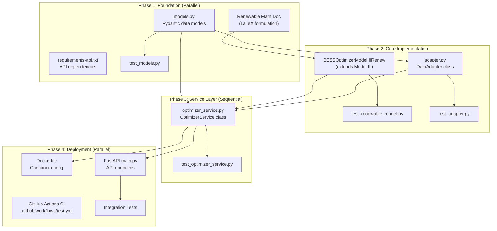

# IBM Hackathon Development Plan: Module D - Optimizer Service

**Document Version:** 1.0
**Date:** 2026-01-31
**Status:** Draft / Awaiting Approval

---

## 1. Executive Summary

This document outlines the implementation plan for upgrading the existing **GridKey BESS Optimizer** into **Module D: Optimizer Service**, as defined in the [GridKey WatsonX Blueprint](file:///d:/my_projects/GridPro/wtsx_hack_gridkey/GridKey_WatsonX_Blueprint.md) (Sections 6.4 - 6.6).

### Key Deliverables

| Deliverable                     | Description                                                                      | Priority |
| ------------------------------- | -------------------------------------------------------------------------------- | -------- |
| **Renewable Integration** | Extend MILP model with PV/Wind generation constraints                            | P0       |
| **Service Wrapper**       | Design `OptimizerService` class with standardised I/O                          | P0       |
| **Data Adapters**         | Implement `DataAdapter`, `OptimizationInput`, `OptimizationResult` classes | P0       |
| **Docker Deployment**     | Create `Dockerfile` and update `requirements.txt` for containerisation       | P1       |
| **API Documentation**     | Define input/output JSON schemas with samples                                    | P0       |

---

## 2. Current State Analysis

### 2.1 Existing Codebase Structure

```
GridKey/
├── src/
│   └── core/
│       └── optimizer.py          # Core MILP optimizer (2417 lines)
│           ├── BESSOptimizerModelI    # Base + aFRR Energy Market
│           ├── BESSOptimizerModelII   # + Cyclic Aging Cost
│           └── BESSOptimizerModelIII  # + Calendar Aging Cost (target)
├── config/
│   └── Config.yml                # Unified configuration
├── data/                         # Market data (Parquet/Excel)
└── requirements.txt              # Current dependencies
```

### 2.2 Key Existing Methods in BESSOptimizerModelIII

| Method                         | Lines       | Purpose                             |
| ------------------------------ | ----------- | ----------------------------------- |
| `__init__()`                 | 2002-2099   | Initialize with degradation configs |
| `load_and_preprocess_data()` | 268-386     | Load Excel market data              |
| `build_optimization_model()` | 2143-2318   | Build Pyomo MILP model              |
| `solve_model()`              | (inherited) | Solve with detected solver          |
| `extract_solution()`         | 2320-2390   | Extract results to dict             |

### 2.3 Missing Components (Gap Analysis)

> **TODO:** The mathematical formulation for renewable integration must be explicitly documented in a dedicated LaTeX file (e.g., `doc/p2_model/p2_renewable_extension.tex`) to align with the existing Model I-III documentation.

| Component              | Blueprint Requirement                                                 | Current Status     |
| ---------------------- | --------------------------------------------------------------------- | ------------------ |
| Renewable Variables    | `P_renewable_self`, `P_renewable_export`, `P_renewable_curtail` | ❌ Not implemented |
| Renewable Constraints  | Generation balance, export revenue                                    | ❌ Not implemented |
| `OptimizerService`   | Unified service wrapper                                               | ❌ Not implemented |
| `DataAdapter`        | Format conversion layer                                               | ❌ Not implemented |
| `OptimizationInput`  | Standardised input model                                              | ❌ Not implemented |
| `OptimizationResult` | Standardised output model                                             | ❌ Not implemented |
| `ScheduleEntry`      | Per-timestep schedule item                                            | ❌ Not implemented |
| Dockerfile             | Container deployment                                                  | ❌ Not implemented |

---

## 3. Proposed Changes (By Implementation Phase)

> This section is organized according to the [Implementation Flow & Dependencies](#7-implementation-flow--dependencies) diagram.

### Phase 1: Foundation (Parallel Tasks)

These components have **no dependencies** and can be implemented simultaneously. Details refer to [ibm_hack_dev_phase1.md](ibm_hack_dev_phase1.md).

📝 **Test:** `test_models.py` — Pydantic validation

---

### Phase 2: Core Implementation (Parallel After Phase 1)

These components depend on **Phase 1** but can be implemented **in parallel with each other**. Details refer to [ibm_hack_dev_phase2.md](ibm_hack_dev_phase2.md).

📝 **Test:** `test_adapter.py`, `test_renewable_model.py` — DataAdapter, MILP constraints

---

### Phase 3: Service Layer (Sequential)

This component is the **critical path** — it depends on both Phase 1 and Phase 2. Details refer to [ibm_hack_dev_phase3.md](ibm_hack_dev_phase3.md).

📝 **Test:** `test_optimizer_service.py` — End-to-end workflow

---

### Phase 4: Deployment (Parallel After Phase 3)

These components depend on **Phase 3** but can be implemented **in parallel with each other**. Details refer to [ibm_hack_dev_phase4.md](ibm_hack_dev_phase4.md).

📝 **Test:** Integration tests, Docker tests — API endpoints, container

Contents:
- **4.1** Dockerfile — Container Configuration
- **4.2** FastAPI main.py — API Endpoints  
- **4.3** API Input/Output Format Specification
- **4.4** GitHub Actions CI Workflow
- **4.5** Integration Tests

---

## 4. Verification Strategy

> **Key Principle:** Tests should be written alongside implementation in each phase, not deferred to the end.

### 4.1 Per-Phase Testing

| Phase | Test Files | Scope |
|-------|------------|-------|
| Phase 1 | `test_models.py` | Pydantic model validation, serialization |
| Phase 2 | `test_adapter.py`, `test_renewable_model.py` | DataAdapter conversion, MILP constraint correctness |
| Phase 3 | `test_optimizer_service.py` | End-to-end service workflow |
| Phase 4 | Integration tests, Docker tests | API endpoints, container deployment |

### 4.2 GitHub Actions CI

> **NEW:** Add automated CI/CD pipeline to run tests on every commit/PR.

Location: `.github/workflows/test.yml`

> Full workflow configuration (including Docker build job) is documented in [ibm_hack_dev_phase4.md](ibm_hack_dev_phase4.md#44-new-github-actions-ci-workflow).

### 4.3 Test Commands

```bash
# Run all tests
pytest src/test/ -v

# Run phase-specific tests
pytest src/test/test_models.py -v        # Phase 1
pytest src/test/test_adapter.py -v       # Phase 2
pytest src/test/test_optimizer_service.py -v  # Phase 3

# Run with coverage
pytest src/test/ --cov=src/service --cov-report=html
```

### 4.4 Integration Tests (Phase 4)

> Detailed integration tests (Docker container tests, API tests, synthetic data fixtures) are documented in [ibm_hack_dev_phase4.md](ibm_hack_dev_phase4.md#45-integration-tests).

### 4.5 Manual Verification Checklist

> See [Phase 4 Verification Checklist](ibm_hack_dev_phase4.md#verification-checklist-phase-4) for the complete checklist.

---

## 5. Risk Assessment

| Risk                                                   | Impact | Mitigation                                                  |
| ------------------------------------------------------ | ------ | ----------------------------------------------------------- |
| Renewable integration breaks existing MILP feasibility | High   | Implement as separate subclass, extensive testing           |
| Solver not available in Docker                         | Medium | Bundle HiGHS, add fallback solver detection                 |
| API performance under load                             | Low    | Add request timeout, async processing for long runs         |
| Backward compatibility with existing scripts           | Medium | Maintain legacy method signatures, add deprecation warnings |

---

## 6. Design Decisions (Resolved)

| Question | Decision |
|----------|----------|
| **Model Naming** | `Model III-renew` (class: `BESSOptimizerModelIIIRenew`) |
| **API Framework** | FastAPI (confirmed) |
| **Curtailment Penalty** | ✅ Add optional `curtailment_penalty` parameter for future flexibility |
| **Docker Base Image** | Solver-optimized image (not `python:3.11-slim`) |
| **Test Data** | Generate synthetic renewable generation data |

---

## 7. Implementation Flow & Dependencies

The following diagram shows which modules can be implemented in **parallel** vs. **sequentially**:



### Dependency Summary

| Module | Depends On | Tests Written |
|--------|------------|---------------|
| `models.py` | None | `test_models.py` (Phase 1) |
| LaTeX formulation | None | N/A (documentation) |
| `requirements-api.txt` | None | N/A |
| `BESSOptimizerModelIIIRenew` | LaTeX formulation | `test_renewable_model.py` (Phase 2) |
| `adapter.py` | `models.py` | `test_adapter.py` (Phase 2) |
| `optimizer_service.py` | `models.py`, `adapter.py`, Optimizer | `test_optimizer_service.py` (Phase 3) |
| `Dockerfile` | `optimizer_service.py` | Docker integration tests (Phase 4) |
| `main.py` (API) | `optimizer_service.py` | API integration tests (Phase 4) |
| GitHub Actions CI | All tests | Runs automatically on commit/PR |

---

## Document History

| Version | Date       | Author       | Changes       |
| ------- | ---------- | ------------ | ------------- |
| 1.0     | 2026-01-31 | GridKey Team | Initial draft |
