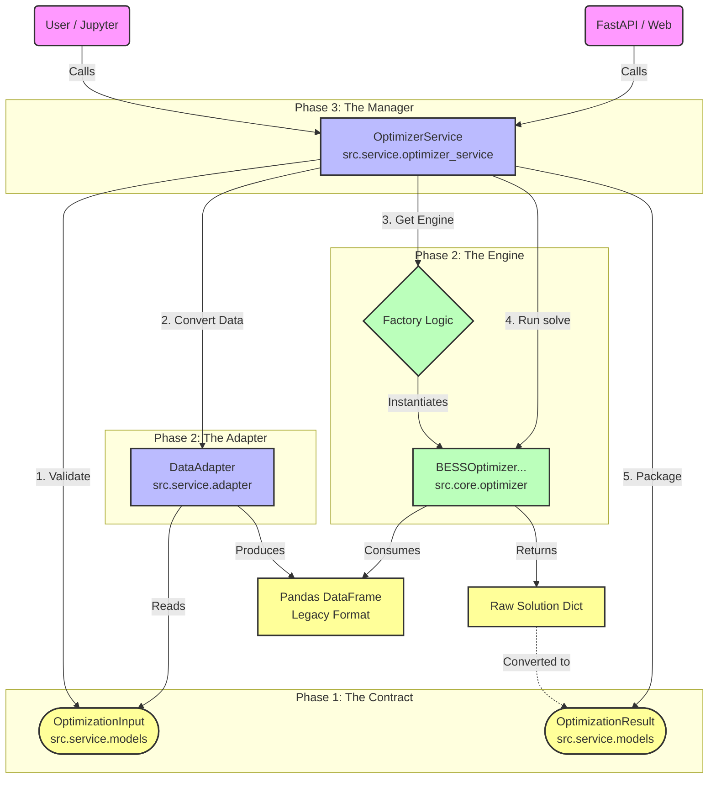

# Phase 1-3 Implementation Summary: The Service Layer Evolution

> "From a Raw Script to a Production-Ready Service"

This document explains the architectural evolution of the GridKey project through Phases 1, 2, and 3. It clarifies how the new Service Layer components (Models, Adapter, Service) wrap the core optimization engine to create a robust, type-safe, and easy-to-use system.

## 1. The Big Picture: Architecture Diagram

The following diagram illustrates the dependencies and data flow between the modules.



## 2. Phase Breakdown

### Phase 1: The Contract (Data Models)
*   **Module:** `src.service.models`
*   **Role:** Defines the "Language" of the system.
*   **Key Components:**
    *   `OptimizationInput`: What the user MUST provide (Prices, Battery Specs). It uses Pydantic to validate data types and constraints (e.g., efficiency > 0).
    *   `OptimizationResult`: What the system GUARANTEES to return. No more guessing dictionary keys.
*   **Analogy:** The **Menu** in a restaurant. It tells customers exactly what they can order and what they will get.

### Phase 2: The Adapter & The Engine Extension
*   **Module A (Adapter):** `src.service.adapter`
    *   **Role:** The "Translation Layer".
    *   **Function:** Converts the clean, modern `OptimizationInput` object into the complex, raw Pandas DataFrame format that the legacy optimizer engine expects.
    *   **Analogy:** The **Translator** between the front-of-house staff (who speak English) and the head chef (who speaks only Pandas).
*   **Module B (Optimizer Extension):** `src.core.optimizer -> BESSOptimizerModelIIIRenew`
    *   **Role:** The "Calculation Engine Upgrade".
    *   **Function:** Adds renewable energy logic (Solar PV integration) to the existing MILP solver capability. It inherits from Model III and adds new constraints.
    *   **Analogy:** A **New Oven** in the kitchen that can handle Solar components.

### Phase 3: The Service (Orchestration)
*   **Module:** `src.service.optimizer_service`
*   **Role:** The "Manager" / "Facade".
*   **Function:**
    1.  Receives raw data from the user.
    2.  Validates it using Phase 1 Models.
    3.  Translates it using Phase 2 Adapter.
    4.  Selects and runs the correct Phase 2 Optimizer Engine.
    5.  Packaged the output into Phase 1 Result Models.
*   **Analogy:** The **Restaurant Manager**. The customer only talks to them ("I want optimization"), and they coordinate the entire kitchen workflow to deliver the result.

## 3. Why This Complexity? (The "Why" behind the Layers)

You might ask: *"Why not just call `optimizer.solve()` directly?"*

1.  **Safety & Validation:** Direct calls allow users to pass garbage data (e.g., negative prices, wrong list lengths) that crash the solver deep in the process. The Service Layer catches these errors immediately at the door.
2.  **Decoupling:** If we later change the optimization engine (e.g., switch from Pyomo to Gurobi native API), the user Code (Jupyter/FastAPI) doesn't need to change at all. Only the Service/Adapter internals change.
3.  **API Readiness:** This structure is 100% ready to be exposed as a REST API. The `OptimizationInput` maps 1:1 to a JSON POST body.

## 4. How to Use It (The Ergonomic API)

This is the "End Game" experience we have built:

```python
from src.service import OptimizerService, OptimizationInput

# 1. Initialize the Service (The Manager)
service = OptimizerService()

# 2. Define Input (The Order)
input_data = OptimizationInput(
    da_prices=[...], 
    renewable_forecast=[...],
    model_type="III-renew"
)

# 3. Optimize (The Magic)
result = service.optimize_from_input(input_data)

# 4. Use Result (The Satisfaction)
print(f"Profit: {result.net_profit} EUR")
```
