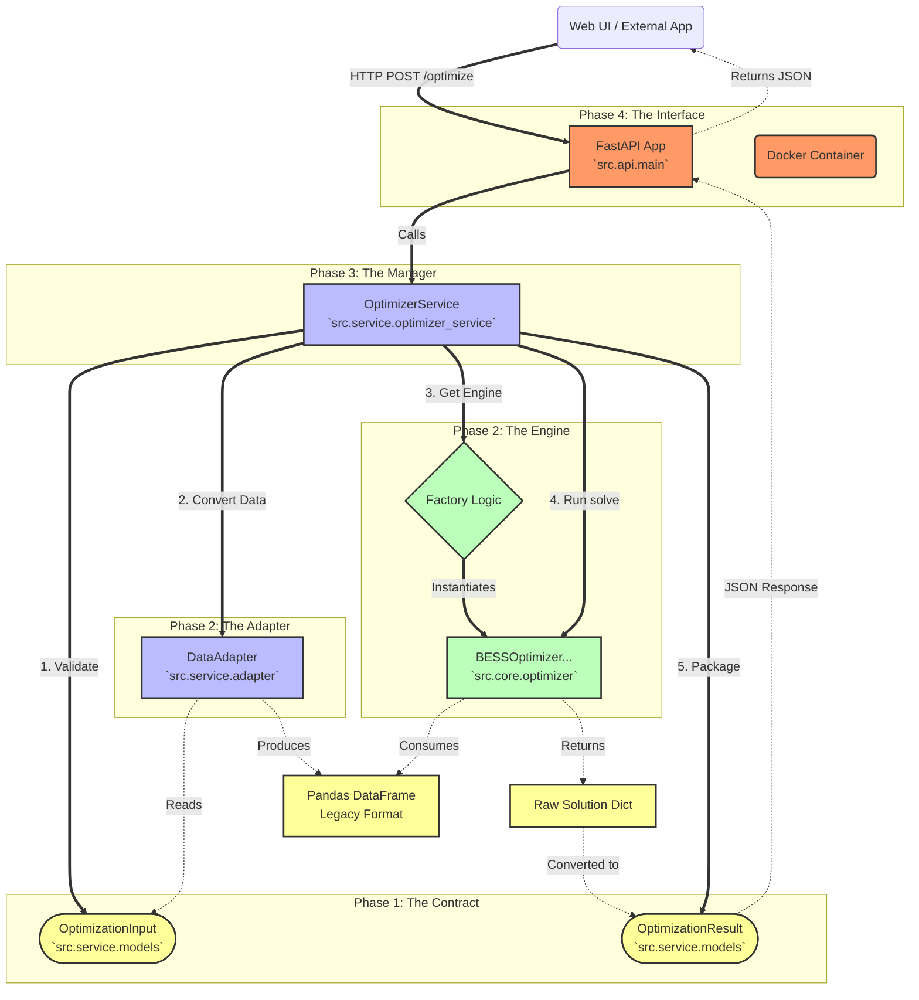

# Phase 1-4 Implementation Summary: From Core Engine to Cloud Service

> "From a Raw Script to a Production-Ready API"

This document explains the architectural evolution of the GridKey project through Phases 1 to 4. It clarifies how the Service Layer components wrap the core optimization engine, and how the Deployment Layer exposes this capability to the world.

## 1. The Big Picture: Architecture Diagram

The following diagram illustrates the dependencies and data flow across all four phases.



**Legend: Color Codes**

| Color | Component Type | Description |
| :--- | :--- | :--- |
| <span style="background-color:#f96; color:black; padding:2px 5px; border-radius:3px;">Orange</span> | **Deployment Layer** | Public-facing interfaces (HTTP API, Docker) that expose the service to the world. |
| <span style="background-color:#bbf; color:black; padding:2px 5px; border-radius:3px;">Blue</span> | **Service Layer** | The orchestrator and adapter logic that manages workflow and translation. |
| <span style="background-color:#bfb; color:black; padding:2px 5px; border-radius:3px;">Green</span> | **Core Layer** | The heavy-lifting optimization engine (Math/Solver logic). |
| <span style="background-color:#ff9; color:black; padding:2px 5px; border-radius:3px;">Yellow</span> | **Data Layer** | Data contracts (Pydantic models) and intermediate data structures. |

**Legend: Line Styles**

| Line Style | Flow Type | Meaning |
| :--- | :--- | :--- |
| **Thick Solid Line** (`==>`) | **Control Flow** | Commands, Function Calls, or Instructions (Active, "Do this"). |
| **Dotted Line** (`-.->`) | **Data Flow** | Return Values, Data Transfer, or Responses (Passive, "Here is the result"). |


## 2. Phase Breakdown

### Phase 1: The Contract (Data Models)
*   **Module:** `src.service.models`
*   **Role:** Defines the "Language" of the system.
*   **Key Components:**
    *   `OptimizationInput`: What the user MUST provide (Prices, Battery Specs). It uses Pydantic to validate data types and constraints (e.g., efficiency > 0).
    *   `OptimizationResult`: What the system GUARANTEES to return. No more guessing dictionary keys.
    *   **Implementation Detail:** Uses `pydantic.Field` for rich validation and `ConfigDict` for JSON schema generation (Swagger UI support).
*   **Analogy:** The **Menu** in a restaurant. It tells customers exactly what they can order and what they will get.

### Phase 2: The Adapter & The Engine Extension
*   **Module A (Adapter):** `src.service.adapter`
    *   **Role:** The "Translation Layer".
    *   **Function:** Converts the clean, modern `OptimizationInput` object into the complex, raw Pandas DataFrame format that the legacy optimizer engine expects.
    *   **Analogy:** The **Translator** between the front-of-house staff (who speak English) and the head chef (who speaks only Pandas).
*   **Module B (Optimizer Extension):** `src.core.optimizer -> BESSOptimizerModelIIIRenew`
    *   **Role:** The "Calculation Engine Upgrade".
    *   **Function:** Adds renewable energy logic (Solar PV integration) to the existing MILP solver capability. It inherits from Model III and adds new constraints.
    *   **Implementation Detail:** Uses `pyomo` to define linear constraints for self-consumption ($P_{self}$), export ($P_{export}$), and curtailment ($P_{curtail}$).
    *   **Analogy:** A **New Oven** in the kitchen that can handle Solar components.

### Phase 3: The Service (Orchestration)
*   **Module:** `src.service.optimizer_service`
*   **Role:** The "Manager" / "Facade".
*   **Function:**
    1.  Receives raw data from the user.
    2.  Validates it using Phase 1 Models.
    3.  Translates it using Phase 2 Adapter.
    4.  Selects and runs the correct Phase 2 Optimizer Engine (Factory Pattern).
    5.  Packaged the output into Phase 1 Result Models.
*   **Implementation Detail:** Maintains a cache of optimizer instances (`_optimizer_cache`) to avoid re-initializing heavy Pyomo objects for every request.
*   **Analogy:** The **Restaurant Manager**. The customer only talks to them ("I want optimization"), and they coordinate the entire kitchen workflow to deliver the result.

### Phase 4: The Interface (Deployment)
*   **Module:** `src.api.main` (FastAPI) & `Dockerfile`
*   **Role:** The "Delivery Service".
*   **Function:**
    *   Exposes the `OptimizerService` via HTTP REST endpoints (`POST /api/v1/optimize`).
    *   Provides automatic interactive documentation (Swagger UI at `/docs`).
    *   Packages the entire application into a portable Docker container.
*   **Implementation Detail:**
    *   **FastAPI:** Handles HTTP request parsing, async execution, and error handling.
    *   **Docker:** Uses a `python:3.11-slim` base image with pre-installed solvers (HiGHS,cbc) for a "battery-included" deployment.
    *   **CI/CD:** GitHub Actions automatically run tests and build the Docker image on every push.
*   **Analogy:** The **Delivery App**. It allows anyone, anywhere to order from the restaurant without walking into the kitchen.

## 3. Why This Complexity? (The "Why" behind the Layers)

You might ask: *"Why not just call `optimizer.solve()` directly?"*

1.  **Safety & Validation:** Direct calls allow users to pass garbage data (e.g., negative prices, wrong list lengths) that crash the solver deep in the process. The Service Layer catches these errors immediately at the door.
2.  **Decoupling:** If we later change the optimization engine (e.g., switch from Pyomo to Gurobi native API), the user Code (Jupyter/FastAPI) doesn't need to change at all. Only the Service/Adapter internals change.
3.  **Scalability:** The Service Layer is stateless (except for caching), allowing multiple API instances to run in parallel behind a load balancer.

## 4. How to Use It (The Ergonomic API)

### Option A: Python SDK (The "Power User" Way)

```python
from src.service import OptimizerService, OptimizationInput

# 1. Initialize
service = OptimizerService()

# 2. Define Input
input_data = OptimizationInput(
    da_prices=[...], 
    renewable_forecast=[...],
    model_type="III-renew"
)

# 3. Optimize
result = service.optimize_from_input(input_data)
```

### Option B: HTTP API (The "System Integrator" Way)

```bash
curl -X POST http://localhost:8000/api/v1/optimize \
  -H "Content-Type: application/json" \
  -d '{
    "model_type": "III-renew",
    "market_prices": { ... },
    "renewable_generation": [ ... ]
  }'
```
