# TechArena, Phase 2 Update

## Phase II Overview

* In Phase II, students have the opportunity to improve their codes to achieve better and more optimized solutions. 
* The new phase must include **the effect of battery degradation**. In other words, the operational strategy should aim to maximize battery lifetime. 
    > - [ ] Comment by Gen: Shall this be optimized as a bi-objective problem, show optimal solutions in Pareto plots?
* From an operational perspective, participants should also **integrate the aFRR market and intraday trading** into their EMS algorithms.

```mermaid
flowchart TD
    subgraph Phase_I["<b>PHASE I</b>"]
        direction TB
        P1A["<b>Operation Optimization</b><br/>(Arbitrage, FCR, aFRR)"]
        P1B["<b>Investment Optimization</b>"]
        P1C["<b>Configuration Optimization</b>"]
    end
    
    Arrow["⬇️ <b>PROGRESSION TO PHASE II</b> ⬇️"]
    
    subgraph Phase_II["<b>PHASE II</b>"]
        direction TB
        subgraph Row1[" "]
            direction LR
            P2A["<b>Operation Optimization</b><br/>(Arbitrage, FCR, aFRR,<br/>🔴 <b>Intraday aFRR</b>)"]
            P2B["<b>Investment<br/>Optimization</b><br/><br/><br/>"]
        end
        subgraph Row2[" "]
            direction LR
            P2C["<b>Configuration<br/>Optimization</b><br/><br/><br/>"]
            P2D["🔴 <b>Battery<br/>Degradation</b><br/><br/><br/>"]
        end
    end
    
    Phase_I --> Arrow
    Arrow --> Phase_II
    
    style Phase_I fill:#ffcccc,stroke:#ff6666,stroke-width:4px
    style Phase_II fill:#ccffcc,stroke:#66cc66,stroke-width:4px
    style Row1 fill:#ccffcc,stroke:none
    style Row2 fill:#ccffcc,stroke:none
    style Arrow fill:#ffffff,stroke:#666666,stroke-width:2px,font-size:18px
    style P1A fill:#fff5f5,stroke:#333,stroke-width:3px,font-size:18px,min-width:200px
    style P1B fill:#fff5f5,stroke:#333,stroke-width:3px,font-size:18px,min-width:200px
    style P1C fill:#fff5f5,stroke:#333,stroke-width:3px,font-size:18px,min-width:200px
    style P2A fill:#f5fff5,stroke:#cc0000,stroke-width:4px,font-size:18px,min-width:250px
    style P2B fill:#f5fff5,stroke:#333,stroke-width:3px,font-size:18px,min-width:250px
    style P2C fill:#f5fff5,stroke:#333,stroke-width:3px,font-size:18px,min-width:250px
    style P2D fill:#f5fff5,stroke:#cc0000,stroke-width:4px,font-size:18px,min-width:250px
```

**Key Changes from Phase I to Phase II:**
- 🔴 **NEW**: Intraday aFRR market integration
- 🔴 **NEW**: Battery Degradation modeling and optimization
- ✅ **Continued**: Investment Optimization
- ✅ **Continued**: Configuration Optimization

### Inclusion of aFRR energy prices for computing reward from aFRR energy market in addition to data in Phase I

| Electricity price | Time resolution | Description | Comment |
|------------------------------------------------------------------------------------------------------------|-----------------|---------------------------------------------------------------------------------------------------------------------------------------------------------------------------------------------------------------------------------------------------------------------------------------------------------------------------------------------------------------|---------------------------------------------------------------------------------------------------------------------------------------------------------------------------------------------------------------------------------------------------------------------------------------------------------------------------------------------------------------------------------------------|
| Proxy for cross-border marginal price of aFRR energy activations | 15-minute       | The aFRR energy market concerns the actual activation of the capacity reserves, which are activated through the Europe-wide PICASSO platform to maintain system balance within five minutes. | - Here, both positive and negative activations should be considered.   - Furthermore, the **actual activation mechanisms** should be considered, where energy is activated, hence rewarded, **only if bids are placed below the cross-border marginal price**.|

## Phase II Evaluation Criteria

| Evaluation Criteria | Ev. Weight | Description |
|---------------------|------------|-------------|
| **Revenue maximization** | 30% | This will evaluate how well the algorithm maximizes revenue based on market prices. |
| **BESS degradation** | 30% | This will evaluate the effect of charge/discharge optimal strategies on battery degradation. |
| **Investment optimization** | 10% | This will evaluate how well the optimal investment locations and markets are identified and assessed. |
| **Configuration optimization** | 10% | This criterion evaluates the analysis of key configuration parameters and their impact on BESS revenue. |
| **Code Quality and Documentation** | 20% | This will evaluate the clarity and structure of the code and deliverable documentation as well as the work presentation. |

Following submission, each team’s battery operational profile will be analyzed using **the ORC Battery Degradation Model** to quantify the impact of their strategy on battery lifetime reduction.
> Crucial to study the ORC model and include it in the optimization process.

## Phase II - Context 
### Why battery degradation is important?
Battery degradation is a critical factor in the operation and management of Battery Energy Storage Systems (BESS). Over time, batteries lose their capacity to hold charge and their efficiency decreases due to various factors such as charge/discharge cycles, depth of discharge, temperature, and operational strategies.

The impact of aging model selection on battery revenue is significant. 
1. Using different aging models can substantially influence the optimal operating strategy of the battery. 
2. More complex aging cost models enable higher profits while maintaining similar SOH final impact[^1].

*Figure 1: Comparison of battery aging models showing the trade-off between revenue optimization and battery degradation. More sophisticated aging cost models can achieve higher profitability while maintaining similar final SOH values.*
> - [ ] Comment from Gen: It's crucial to understand this graph 

#### Major Factors Affecting Battery Degradation During Operation
- [ ] TODO: Prioritize Battery Degradation Factors by P1-P3 (P1 the highest)

| **Factor** | **Impact on Battery Degradation** |
|--------|-------------------------------|
| **Temperature**   >consider regional temperature variations across the five given regions. | • Both high and low temperatures accelerate different degradation modes. • High temperature (>40 °C): Speeds up side reactions (e.g., SEI growth, electrolyte decomposition, gas formation) → capacity fade and internal resistance rise. • Low temperature (<0 °C): Increases lithium plating on the anode during charging → irreversible lithium loss and safety risks. • Thermal management is critical; degradation roughly doubles for every 10 °C increase (Arrhenius behavior). |
| `P1` **Charge/Discharge Rate (C-rate)** | • Higher C-rates accelerate degradation. • In fast charging, lithium ions can't diffuse fast enough → lithium plating on the anode. • High discharge rates cause increased internal heating, mechanical strain, and contact loss which causes reduced active material utilization and faster capacity fade. |
| `P1` **SoC Range** | • Operating at very high or very low SoC accelerates aging. • High SoC (>90%): Cathode oxidation, transition metal dissolution, electrolyte oxidation. • Low SoC (<10%): Copper dissolution from the anode current collector and deep lithiation damage. • *Restriction of SoC window (e.g., 20–80%) can minimize structural and chemical stress.* |
| `p1` **Depth of Discharge** | • Larger DoD (e.g., 0–100%) shortens cycle life; shallow cycling (e.g., 20–80%) improves lifetime. • Each cycle's voltage and strain swing cause mechanical and chemical stress on electrodes. • High DoD → More electrode expansion/contraction → micro-cracks and SEI rupture → increased irreversible capacity loss. |
| **Battery Management System (BMS) Strategy** | • Directly influences lifetime by controlling operation conditions. • Smart algorithms (SoC windowing, temperature regulation, current limits) can minimize stress; poor algorithms exacerbate it. • Optimized BMS can double the usable life. |
| `P0` **Calendar Aging (Storage Conditions)**   check this [aging aware MPC](https://gitlab.lrz.de/open-ees-ses/aging-aware-MPC) | • Even when not in use, batteries degrade over time. • SEI thickening, electrolyte oxidation, and loss of cyclable lithium occur during storage, especially at high temperature and SoC. • Degradation is faster at high SoC and high temperature — typically expressed as a function of (T, SoC). |

### Same data for Investment and Configuration Optimization as Phase I
* Participants should still optimize the investment locations and configurations of BESS across the five given regions (DE, AT, CH, HU, CZ) as in Phase I.
  * The weighted-average cost of capital (WACC) remains as: **DE, AT, CH**: 8.3%; **CZ**: 12.0%; **HU**: 15.0%.
  * Inflation rate remains as: **DE**: 2.0%; **AT**: 3.3%; **CH**: 0.1%; **CZ**: 2.9%; **HU**: 4.6%.

* BESS Features remain as:
  * **Energy Capacity**: 4472 kWh
  * **Power Rating**: 2236 kW
  * **Charge/Discharge C-Rates**: 0.25C, 0.33C, 0.50C
  * **Daily Number of Cycles**: 1.0, 1.5, 2.0
  * **Cooling Method**: Liquid Cooling
  * **Investment Cost**: 200 EUR/kWh

## Reviewer's Feedback from Phase I
* All submitted codes must be **well-commented** and the comments should be written in clear English.
* Only **open-source** Python libraries are allowed, no commercial or restricted packages.
* Each submission must include **a detailed report** describing the solution methodology, optimization approach, and results analysis.
* This is not a coding competition, but **an Energy Management System algorithm development challenge**, participants should **demonstrate a clear understanding of EMS concepts**.
    > - [ ] Comment by Gen: For this purpose, I believe a web-based dashboard visualization of the results will be highly practical.
* Ensure that **all specified countries are properly included** and analyzed in your results.

## Project Q&A Google Doc
* [Link to Phase II Q&A Document](https://docs.google.com/document/d/1NHbycnyq_boqihHSY8Gw4GtrUCdVqaBkwO1my5SLUsY/edit?mc_cid=906bdbf5ee&mc_eid=b9c7877496&pli=1&tab=t.0)

### Asked Questions
1. I have a few questions regarding battery degradation and the activation of aFRR prices:
Is the final submission format still the same — with three output files? Now in phase 2, the 10 years period ROI is considering each years' battery Degradation(capacity become lower in the next year)?
    > **A**: Yes

2. Should we include more BESS Configuration details (e.g. working temperature, charging power profile,charging time etc.) in the Configuration output file? Or can we just describe these assumptions in the documentation and use them to optimize our operation strategy?
    > **A**: Good point. Please include any additional aspects or parameters you believe would help improve the accuracy of the battery degradation calculation.

3. The final evaluation will use our Operation files with the BESS model build by the organizer , But we cannot know the specific model detail during our work. We need to find information on our own to identified different component that effects the battery degradation and improve our Operation strategy, is my understanding correct?
    > **A**: Yes, calculating battery degradation is the main challenge. There are multiple models with different levels of complexity; your task is to select the appropriate model and all required sub-components to achieve the most accurate degradation estimate.

## Bonus: Challenge for real-time trading: Uncertain aFRR energy activation and revenue
* In reality, aFRR energy is activated on a 4-second level based on the cross-border marginal price (CBMP) computed in the PICASSO platform. 4-second CBMP prices are not provided by Huawei, but could be downloaded here: https://www.transnetbw.de/en/energy-market/ancillary-services/picasso 
* If you want to do considerations on 4-second prices, use data from TNG (TransnetBW TSO).

___

## Bibliography
[^1]: Collath, Nils, et al. "Increasing the lifetime profitability of battery energy storage systems through aging aware operation." *Applied Energy* 348 (2023): 121531.
